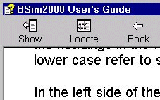
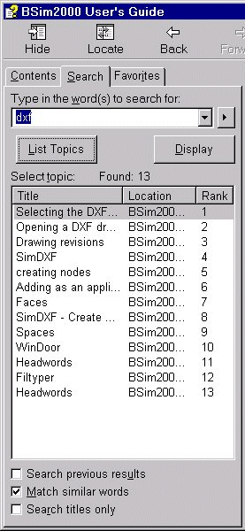

<link rel="stylesheet" href="../style.css">

# Help structure
A common help text exists for all modules in BSim, although some modules are only available as add-ons to the basic package or only available in BSim version 2002 and more recent. These pages are formatted with a light yellow background.

Help is based on a design allowing direct access to the Danish Building Research Institute's website plus the BSim web site.

<figure id="center_img">

<figcaption>Links at the top right-hand corner of the help pages.</figcaption>
</figure>

At the top right of every help page the logo of Danish Building Research Institute and a button labeled BSim.dk are found. Clicking the logo will take the user to the main page of Danish Building Research Institute's website on the Internet. Clicking the BSim.dk button will take the user to the main page of BSim. From the main BSim page there is a direct link to an English version of the BSim pages and to the web page of the German distributor of BSim.

<figure id="center_img">

<figcaption>Buttons at the toolbar of the help-pages.</figcaption>
</figure>

At the top of the help pages there is a toolbar, giving access to some functions. The label of some buttons depend on the current language version of the operating system.

*   *Home* opens a standard start page in the help file, holding information on terms of delivery and liability.

*   *Print* allows for [printing](https://help.bsim.dk/support/kb/articles/EWBOrLmr/udskrift-af-hj-lpesider) parts of or the whole help text.

*   *Setup* opens a menu for defining how help should be shown.

*   *Version check* opens a file at Danish Building Research Institute homepage (does **only** work if you are connected to the Internet) in which the version number of the most recent help file for download from [www.bsim.dk](http://www.bsim.dk) is given.

*   *Headwords* opens the list of headwords in help.  

In the left side of the User's Guide, three tabs are found: *Contents*, *Search* and *Favorites* (may wary depending on the actual language version of MS-Windows on your PC). If none of these are shown, they can be revealed by pressing the *Show* button at the top left in the toolbar.

<figure id="center_img">

<figcaption>Show tabs in BSim User's Guide.</figcaption>
</figure>

*   *<u>C</u>ontents* shows an overview of the chapters of the User's Guide. It possible to maneuver in the User's Guide by clicking the mouse in the tree.

*   *<u>S</u>earch* offers the opportunity of free text search in the entire User's Guide. It is among others possible to search the name of any dialog (shown left on the title bar of the dialog, i.e. "BSim User's Guide"). Dialogs called by clicking buttons in other dialogs are named as: parent dialog name | dialog name.  

<figure id="center_img">

<figcaption>Tabs in BSim User's Guide searching for "dxf" at the Search tab.</figcaption>
</figure>

The search can be refined using the three options at the bottom of the search window.

*   In *Favor<u>i</u>tes* it is possible to save links to pages often used.

Generally graphics are used as illustrations of different functions in the program in terms of screen dumps and drawings. Some of these graphic elements contain hot-spots, leading on to other help pages or somewhere else in the same page, where the topic is described more detailed. Graphics with hot-spots are marked with a thin blue frame. It is not possible to see in which parts of the graphic the hot-spots are, but when moving the cursor over the graphic, the shape of the cursor changes to a hand  when located over a hotspot.
