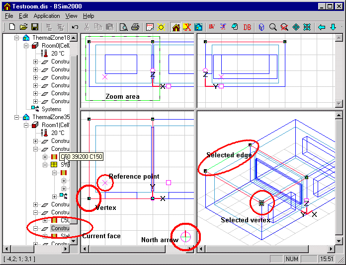

<link rel="stylesheet" href="../style.css">

# Structure of BSim

The programs in the *BSim suite are built up around SimView*, a central program and user interface with model editor. In *SimView* the model is displayed in a hierarchical tree summary – like that used in Windows Explorer, for example – down the left-hand side of the screen. The tree summary can be collapsed or expanded to display a large or small part of the model at one time. If text is too long to display in full, it can be viewed by holding the mouse cursor over the text string. The full text will be displayed in a speech bubble. Generally speaking, information on the object currently under the mouse cursor is provided in this way throughout the software suite.

In *SimView* a building model is displayed both in the form of a hierarchical tree summary on the left of the screen and in the form of a graphical view on the right of the screen. The graphical view is divided up into a floor plan, two elevations and a spatial view. *North is displayed in the bottom right-hand corner of the floor plan to show the rotation of the current building*.

The right-hand side of the screen is therefore divided into four fields, which display the model in the form of

*   an elevation at right angles to the X-axis or from north to south if the model has not been rotated (top left)

*   an elevation at right angles to the Y-axis or from east to west if the model has not been rotated (top right)

*   a plan drawing (bottom left)

*   a spatial view (bottom right)

A north arrow indicating the rotation of the model is also displayed in the plan drawing.

The models are defined in a system of spatial coordinates in which the  **X-axis** is positive towards east, the **Y-axis** is positive towards north and the **Z-axis** is positive upwards. 

The buildings of the model can be located with faces having a negative z-value. This do **not** mean that the model is below the surface of the ground, even though it looks like it in the spatial view. Sun will thus still be able to come through windows located all or partially beneath the origin of the co-ordinate system.

The system lines of the model are defined in [SimView](https://help.bsim.dk/support/kb/articles/wQXx2xQK/simview) or imported from a CAD drawing using the [SimDXF](https://bsim.outseta.com/support/kb/articles/jW7oNkWq/cad-tegninger-som-grundlag-for-geometri) program.

When constructions are attached to the surfaces of the model they are drawn as:

*   Constructions facing *Outdoor or Ground* are drawn from the system line and <u>inward</u>.

*   Constructions between two rooms are drawn symmetric around the system line.

<figure id="center_img">

<figcaption>The program window in SimView with the tree summary on the left and four views of the model on the right.</figcaption>
</figure>

The model's individual objects can be [worked on and examined](https://bsim.outseta.com/support/kb/articles/DQ2xp4WV/operationer-med-musen-i-simview) by clicking the mouse in combination with the Ctrl and Shift keys on the keyboard. Clicking with the left mouse button is called a left click (or just a click), while a click with the right mouse button is called a right click.

It is generally possible to change the view of the building model. The user can zoom in or out by pressing "+" or "-", and the model can be rotated by pressing "right arrow" or "left arrow". The same functions are also available on the toolbar or by selecting *<u>V</u>iew* | *<u>V</u>iew* followed by *Zoom In, Zoom Out* or *ViewPoint*.

Simple editing can be done directly in the tree summary. A system, for example, can be moved by dragging it from one thermal zone to another. Spaces can be [added to thermal zones](https://help.bsim.dk/support/kb/articles/amRGJpQJ/tilfoje-rum-til-termiske-zoner) by dragging them into the zone.

In all the programs in the *BSim* suite it is possible to call up a menu by clicking the right mouse button. The menu is different in the various programs ([SimView](https://help.bsim.dk/support/kb/articles/wQXx2xQK/simview), [XSun](https://bsim.outseta.com/support/kb/articles/amRGdMQJ/analyse-af-solindfald-med-xsun), [tsbi5]() and [SimLight](https://bsim.outseta.com/support/kb/articles/LmJvYAmP/dagslysberegninger-med-simlight)) and contains the most frequently used functions for the current location.

It is possible to select faces (constructions) directly in the geometrical view by moving the mouse cursor to the desired object and pressing *Ctrl* + "*left click*" in the 3D view. This highlights the object in red in the geometrical view and the current construction is highlighted in the tree summary. It is also possible to select an object directly by clicking in the tree summary (see: [Add a space](https://help.bsim.dk/support/kb/articles/gWKDMlmp/simview---oprette-et-rum)). It is often easier to select the desired construction in the tree summary than in the 3D geometry.

 

See also:

*   [Toolbar](https://help.bsim.dk/support/kb/articles/E9Lw5nQw/simview---varktojsbjalken)

*   [SimView menu](https://help.bsim.dk/support/kb/articles/49EdrJQ7/simview---menu)

*   [Program menus](https://bsim.outseta.com/support/kb/articles/pWrnYLWn/programmenuer-i-bsim)
