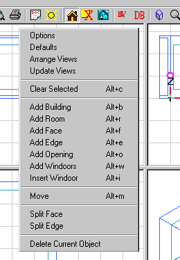

<link rel="stylesheet" href="../style.css">

# SimView - Menu
*The SimView* menu is called up by clicking the right mouse button in one of the four windows showing graphical views of the model (on the right of the screen).

There are five options in the *SimView* menu that are not described under a separate point:

*   *Arrange Views*: Changes the geometric view to give all four windows the same height and width.
*   *Update Views*: Forces an update of the geometric view. Used, for example, when new objects have been added and updating has not been done automatically, e.g. climate data for *tsbi5* or systems in a thermal zone.
*   *Delete Current Object*: Deletes the object currently selected (space, thermal zone, system, etc.).
*   *Clear Selected*: Cancels choice of objects.

<figure id="center_img">

<figcaption>Right-click menu in SimView.</figcaption>
</figure>

The individual menu options call up various dialog boxes that will be discussed in greater detail when the individual items are described:

*   [Options](../09SimView/09_16_SimView_Options.md)
*   [Defaults](../24Miscellaneous/24_28_Insert_Default_Options.md)
*   [Add Building](06_09_SimView_Creating_a_building.md)
*   [Add Room](../09SimView/09_15_SimView_Creating_a_space.md)
*   [Add Face](../09SimView/09_02_SimView_Editing_the_model_geometry.md)
*   [Add Edge](../09SimView/09_02_SimView_Editing_the_model_geometry.md)
*   [Add Opening](../10Thermal_zones/10_08_SimView_Adding_an_opening_or_WinDoor.md)
*   [Add WinDoors](../10Thermal_zones/10_08_SimView_Adding_an_opening_or_WinDoor.md)
*   [Insert Windoor](../10Thermal_zones/10_08_SimView_Adding_an_opening_or_WinDoor.md)  <!-- TODO: verify link -->
*   [Move](../09SimView/09_13_SimView_Move.md)
*   [Split Face](../09SimView/09_02_SimView_Editing_the_model_geometry.md)
*   [Split Edge](../09SimView/09_02_SimView_Editing_the_model_geometry.md)