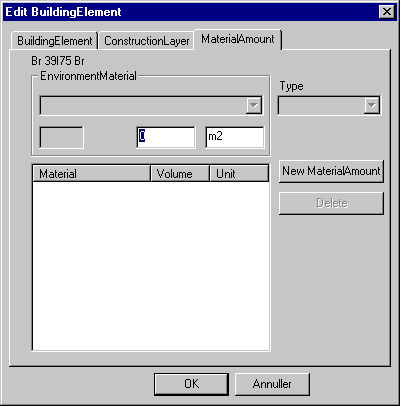

<link rel="stylesheet" href="../style.css">

# SimDB - BuildingElement, MaterialAmount
The third tab only contains data used in connection with LCA analyses and is not described further here.

<figure id="center_img">

<figcaption>Data for LCA-analyses.</figcaption>
</figure>

See also:
*   [Tab BuildingElement](07_02_SimDB_BuildingElement.md)
*   [Tab ConstructionLayer](07_03_SimDB_BuildingElement_ConstructionLayer.md)
