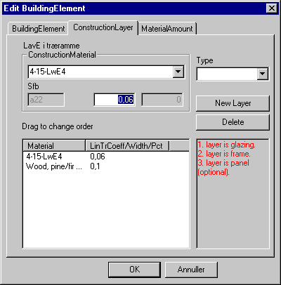

<link rel="stylesheet" href="../style.css">

# Material layers for BuildingConstruction - WinDoor
WinDoors are defined by clicking the "layer" that should be changed/created, after possibly clicking the *New*-button. Now the material type is selected from the *Type* selection box (Note: The glass must be selected from material group "a", the frame from group "b" and the panel from group "c"). Hereafter the material is selected in the *ConstructionMaterial* selection box.

WinDoors are defined in the same database structure as all other constructions, but the un-named fields and the columns in the table have a slightly different meaning.

*   *Construction material* defines the "material" layers of WinDoor:

    *   Field 1 shows the SfB-number of the highlighted material layer (glass, frame or panel).

    *   The meaning of field 2 depends on the layer number:

        *   For layer 1 (glass) field 2 defines the linear heat-loss corfficient through the spacer between the panes of glass (see <a href="#windoor-table"> table</a>).

        *   For layer 2 (frame) field 2 is the width of the frame measured in the plane of the WinDoor (distance from masonry to edge of the glass). The width is assumed to be the same on all sides of the glass.

        *   For layer 3 (panel) field 2 defines the size of the panel of the remaining area - when the frame has been subtracted from the opening area.

*   The table at the bottom of the dialog shows the order of the material "layers". In a WinDoor the order is **important**. First "layer" **must** be the glass, second "layer" **must** be the frame and third "layer" **must** be the panel. The panel do not need to occur in all WinDoor definitions, but only in those with a [layout](../24Miscellaneous/24_30_SimView_Insert_Windoor.md), equal to that of a door. It is possible to change the order of the material "layers" by dragging, while pressing the left mouse button, the layer to a new position in the table.

*   At the bottom right an information field on how to understand the table at the left-hand side is shown.

<figure id="center_img">

<figcaption>Defining a WinDoor in the database.</figcaption>
</figure>

The dialog box for editing material data can be opened by right-clicking the name of the material.

The linear coefficient of transmission heat loss (*LinTrCoeff* or the Ψg value) in W/m K through spacer profiles made of aluminum or ordinary steel are shown in the table below (Source: [DS 418:2002](../20The_Mathematical_basis/20_28_Literature.md)). It is possible to interpolate in the table.

| WinDoor U-value (W/m²K) | Linear coefficient of transmission (W/mK) |
|------------------------|-------------------------------------------|
| 1,0 – 1,2              | 0,10                                      |
| 2,7 – 3,0              | 0,07                                      |

See also:

*   [Tab BuildingElement ](../07SimDB_Database/07_02_SimDB_BuildingElement.md)

*   [Tab MaterialAmount](../07SimDB_Database/07_04_SimDB_BuildingElement_MaterialAmount.md)
