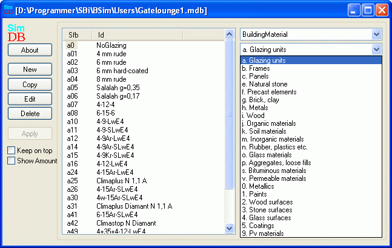

<link rel="stylesheet" href="../style.css">

# SimDB - BuildingMaterial
As with the building elements, the materials are divided into basic [SfB groups](../24Miscellaneous/24_39_SfB_in_BSim.md), each of which is represented by a letter, e.g. "i" for wood. Here too it is important to follow the convention if and when new materials are defined:

*   **a** is used for the glazing in WinDoor's (*glazing*)

*   **b** is used for the frame around the glazing in WinDoor's (*frame*)

*   **c** is used for the panel connected to WinDoors (*panel*)

*   **e** to **s** are the ordinary building materials arranged in material groups

*   **v** is used for properties for vertical, ventilated crevices. From database BSim2006.mdb information on crevices is found in material group "v"

*   **0** to **5** contains information about surface (*Finish*) properties

*   **9** is used for defining photo voltaic systems

<figure id="center_img">

<figcaption>Option for defining and selecting materials (BuildingMaterial) in the database.</figcaption>
</figure>

Clicking *Edit* for a selected material opens a window in which the data registered for the material in question can be edited. The individual tables in the materials database will be described below. The tabs are structured in such a way that they start with the information needed for the main purpose of the database, with new information being added for each new tab. The number and type of tabs displayed depends on which material group (SfB number) has been selected.

See also:
*   [Tab Material](07_11_SimDB_BuildingMaterial_Material.md)
*   [Tab Thermal](07_12_SimDB_BuildingMaterial_Thermal.md)
*   [Tab Environment](07_07_SimDB_BuildingMaterial_Environment.md)
*   [Tab Glazing](07_10_SimDB_BuildingMaterial_Glazing.md)
*   [Tab Transmittance](07_16_SimDB_BuildingMaterial_UserDefined.md)
*   [Tab Frame](07_09_SimDB_BuildingMaterial_Frame.md)
*   [Tab Finish](07_08_SimDB_BuildingMaterial_Finish.md)
