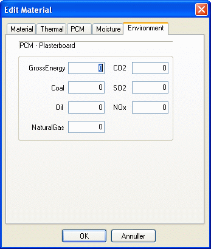

<link rel="stylesheet" href="../style.css">

# SimDB - BuildingMaterial, Environment
The *Environment* tab contains information on the material's environmental impact per unit of measurement.

<figure id="center_img">

<figcaption>Environmental data for the materials in the database.</figcaption>
</figure>

See also:

*   [Tab Material](07_11_SimDB_BuildingMaterial_Material.md)
*   [Tab Thermal](07_12_SimDB_BuildingMaterial_Thermal.md)
*   [Tab Moisture](07_14_SimDB_BuildingMaterial_Moisture.md)

For transparent materials in WinDoors

*   [Tab Glazing](07_10_SimDB_BuildingMaterial_Glazing.md)
*   [Tab Additional](../24Miscellaneous/24_44_SimDb_Glazing_Additional_data.md)
*   [Tab UserDefined](07_16_SimDB_BuildingMaterial_UserDefined.md)
*   [Tab Frame](07_09_SimDB_BuildingMaterial_Frame.md)
*   [Tab Finish](07_08_SimDB_BuildingMaterial_Finish.md)