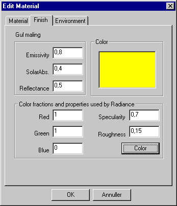
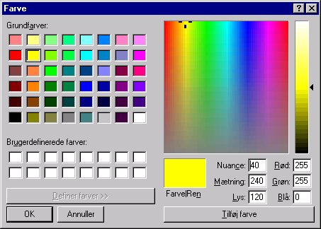

<link rel="stylesheet" href="../style.css">

# SimDB - BuildingMaterial, Finish
The *Finish* tab contains information on the material's finish properties.

Different data are being used when simulating the thermal indoor climate, the energy flows and the daylight conditions. Data for the color of the surface is though only used in daylight simulations and in export of building models to [*Radiance*](../18Radiance_Visualisation_og_the_building/18_01_Exporting_data_to_Radiance.md) for further analyses.

If no material is selected to represent the surface properties, [*SimLight* ](../15SimLight_Daylight_calculations/15_01_Daylight_calculations_with_SimLight.md)will use the following default values for the light-reflectance in the calculation of daylight conditions in the rooms:

*   Floors: 0,1
*   Walls: 0,4
*   Ceilings: 0,7
*   Glass: 0,92

The reflectance from the surrounding free surfaces is obtained from the [Site](../24Miscellaneous/24_25_Site_Property.md) property, if defined. If not defined, 0.1 will be used as default value.

<figure id="center_img">

<figcaption>Information on the material's finish properties is found on the "Finish tab.</figcaption>
</figure>

*   Emissivity: Is being used in the simulation of long-wave radiative heat exchange between surfaces.

*   SolarAbs.: Absorbstance of solar radiation is being used in the thermal simulation of solar heating distribution to the surfaces of the model.

*   LightRefl.: The Light-reflectance is used in simulation of daylight in *SimLight*.

If a color has been defined as a finish property for a face, it will be transferred when the model is exported to Radiance. If a color has not been defined for the finishes, they will be assigned random colors in such a way that they all have different colors. The color is selected by clicking the *Colorbutton*, which opens a color dialog box.

<figure id="center_img">

<figcaption>Dialog box for selecting color as a finish property.</figcaption>
</figure>

See also:

*   [Tab Material](07_11_SimDB_BuildingMaterial_Material.md)
*   [Tab Thermal](07_12_SimDB_BuildingMaterial_Thermal.md)
*   [Tab Moisture](07_14_SimDB_BuildingMaterial_Moisture.md)
*   [Tab Environment](07_07_SimDB_BuildingMaterial_Environment.md)
*   [Tab Glazing](07_10_SimDB_BuildingMaterial_Glazing.md)
*   [Tab UserDefined](07_16_SimDB_BuildingMaterial_UserDefined.md)
*   [Tab Frame](07_09_SimDB_BuildingMaterial_Frame.md)