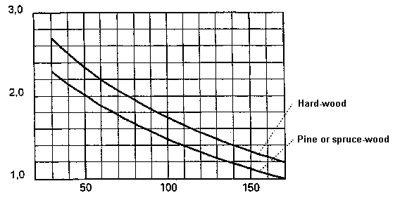

<link rel="stylesheet" href="../style.css">

# SimDB - BuildingMaterial, Frame
This tab only contains a U-value and only appears when materials from [SfB](https://bsim.outseta.com/support/kb/articles/DQ2xwBWV/sfb-i-bsim) material groups "b" or "c" have been selected. The value is used if the material forms part of a WinDoor as a frame construction or panel.

<figure id="center_img">

<figcaption>U-value for a frame construction or panel. Used when the material forms part of a WinDoor.</figcaption>
</figure>

According to the Danish norm [DS418, amendment 1](https://bsim.outseta.com/support/kb/articles/A93zbqQ0/litteratur) the following values can be used as U-values for window frames.

For frames made of wood or covered wood the values can be obtained from the figure below, as a function of the type of wood and the thickness of the frame. This values can be used if a more accurate value is not known. By determining the thickness of frame made of wood, an eventual cover made of metal or plastic is neglected. If the frame have varying thickness, the average value can be used. Having coupled frames (two or more separate glazings) the total thickness of the frame can be used.

<figure id="center_img">

<figcaption>Transmission coefficient Uframe in W/m2K for frames made of wood or covered wood.</figcaption>
</figure>

For frames made of plastic or metal the transmission coefficients given in the following table can be used, unless a more accurate value is known. For PUR-profilers a metal bearing is expected to be covered wit at least 5 mm polyuretan foam. For PVC-profiles it is anticipated that there will be metal enforcement in a maximum of one chamber, and that the distance between the surface in all chambers is at least 5 mm. The transmission coefficient for metal profiles with broken cold-bridge depends strongly on the actual design and must thus be determined for each profile individually.

|         |                     | W/m²K |
|-------------------|----------------------------------|-------|
| **Plastic profiles** | PUR-profiler                     | 2,6   |
|                   | 2‑chamber PVC-profiles           | 2,1   |
|                   | 3‑chamber PVC-profiles           | 1,9   |
| **Metal profiles**   | without broken cold bridge        | 5,9   |

*Transmission coefficient Uframe in W/m²K for frames made of plastic or metal profiles.*

For windows with individual frames and a distance of at least 10 mm between the frames, the transmission coefficient can be calculated as:
$$
U = \frac{1}{\frac{1}{U_u} + \frac{1}{U_i}}
$$

where *Uu* and *Ui* is the transmission coefficient for respectively the external and the internal part of the window.

 

See also:

*   [Tab Material](https://help.bsim.dk/support/kb/articles/4966z49X/simdb---buildingmaterial-material)
*   [Tab Thermal](https://help.bsim.dk/support/kb/articles/y9q8b2QA/simdb---buildingmaterial-thermal)
*   [Tab Moisture](https://help.bsim.dk/support/kb/articles/wQXx4nQK/simdb---buildingmaterial-moisture)
*   [Tab Environment](https://help.bsim.dk/support/kb/articles/nmDBzx9y/simdb---buildingmaterial-environment)
*   [Tab Glazing](https://help.bsim.dk/support/kb/articles/7maw2j9E/simdb---buildingmaterial-glazing)
*   [Tab UserDefined](https://help.bsim.dk/support/kb/articles/xmerM5QV/simdb---buildingmaterial-userdefined)
*   [Tab Frame](https://help.bsim.dk/support/kb/articles/ZmNreEm2/simdb---buildingmaterial-frame)