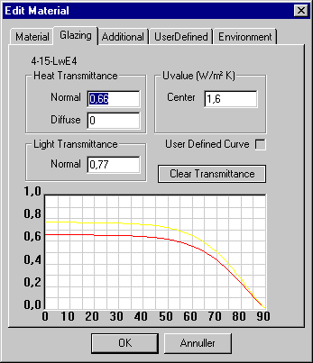

<link rel="stylesheet" href="../style.css">

# SimDB - BuildingMaterial, Glazing
The *Glazing* and [*UserDefined* ](07_16_SimDB_BuildingMaterial_UserDefined.md)tabs belong together and contain information concerned with transparent materials that are used as part of a WinDoor and form part of simulations with *tsbi5* or *Bv98*. These tabs are **only** displayed for materials from [SfB](../24Miscellaneous/24_39_SfB_in_BSim.md) material group "a".

<figure id="center_img">

<figcaption>Data for the glass part of a WinDoor (Edit Material | Glazing). At the bottom the curve for the angle of incidence dependence of the heat and light transmittance.</figcaption>
</figure>

The meaning of the fields in this dialog are:

*   *Heat Transmittance*:

    *   *Normal*: Solar energy transmittance ([g-value](../20The_Mathematical_basis/20_28_Literature.md)) for solar radiation normal to the glass pane. If more detailed information (especially used when modeling transparent insulation materials) is known for the solar energy transmittance at different angles of incidence, this **can** be given at the [UserDefined](07_16_SimDB_BuildingMaterial_UserDefined.md) tab.

    *   *Diffuse*: Solar energy transmittance for diffuse radiation. If no exact value is known, "0" should be given as the program assumes a transmittance for diffuse solar radiation (reflected from surroundings, i.e. neighbor buildings, ground, clouds etc.) equal to the transmittance for direct radiation at an angle of incidence of 60 °. If a value different from "0" is given, it should be less than the value given for the transmittance of direct solar radiation.

*   *Light Transmittance - Normal*: Is the transmittance for daylight at radiation normal to the glass.

*   *Uvalue - Center*: The center U-value of the glass [W/m²K].

*   *User Defined Curve*: Inactive field indicating (with a tick mark) that the curve of transmittance is calculated from user given data, defined on the [*UserDefined* ](07_16_SimDB_BuildingMaterial_UserDefined.md)tab.

*   *Clear Transmittance*: Pressing this button clears data from the [*UserDefined* ](07_16_SimDB_BuildingMaterial_UserDefined.md)tab and uses the normal formula for calculation of heat and light transmittance, based on the transmittance at radiation normal to the glass.

At the bottom of the dialog the curves for heat and light transmittance are shown as a function of the angle of incidence. The transmittance for direct solar radiation is shown as a red curve and the transmittance for daylight as a yellow curve.

 

See also:

*   [Tab Material](07_11_SimDB_BuildingMaterial_Material.md)
*   [Tab Thermal](07_12_SimDB_BuildingMaterial_Thermal.md)
*   [Tab Moisture](07_14_SimDB_BuildingMaterial_Moisture.md)
*   [Tab Environment](07_07_SimDB_BuildingMaterial_Environment.md)
*   [Tab UserDefined](07_16_SimDB_BuildingMaterial_UserDefined.md)
*   [Tab Frame](07_09_SimDB_BuildingMaterial_Frame.md)
*   [Tab Finish](07_08_SimDB_BuildingMaterial_Finish.md)