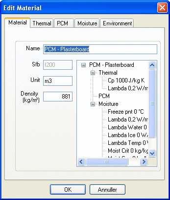

<link rel="stylesheet" href="../style.css">

# SimDB - BuildingMaterial, Material
Here, as everywhere else, it is important to choose meaningful names for subsequent use in the software.

A number of tabs are shown at the top of the dialog. Which tabs to be shown depends on the material group of the current material.

<figure id="center_img">

<figcaption>Window for editing a material in the database. The Material tab contains information, such as the density and the unit of measurement used for the material - m³ in this instance - which is needed in connection with thermal analysis and LCA analysis.</figcaption>
</figure>

Information for use in various contexts is provided on the following tabs:

 

See also:

*   [Tab Thermal](https://help.bsim.dk/support/kb/articles/y9q8b2QA/simdb---buildingmaterial-thermal)
*   [Tab Moisture](https://help.bsim.dk/support/kb/articles/wQXx4nQK/simdb---buildingmaterial-moisture)
*   [Tab Environment](https://help.bsim.dk/support/kb/articles/nmDBzx9y/simdb---buildingmaterial-environment)
*   [Tab Glazing](https://help.bsim.dk/support/kb/articles/7maw2j9E/simdb---buildingmaterial-glazing)
*   [Tab UserDefined](https://help.bsim.dk/support/kb/articles/xmerM5QV/simdb---buildingmaterial-userdefined)
*   [Tab Frame](https://help.bsim.dk/support/kb/articles/ZmNreEm2/simdb---buildingmaterial-frame)
*   [Tab Finish](https://help.bsim.dk/support/kb/articles/BWzdbgQE/simdb---buildingmaterial-finish)
