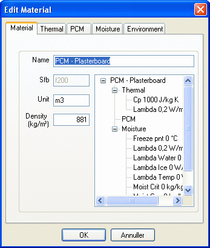

<link rel="stylesheet" href="../style.css">

# SimDB - BuildingMaterial, Material
Here, as everywhere else, it is important to choose meaningful names for subsequent use in the software.

A number of tabs are shown at the top of the dialog. Which tabs are shown depends on the material group of the current material.

<figure id="center_img">

<figcaption>Window for editing a material in the database. The Material tab contains information, such as the density and the unit of measurement used for the material - m³ in this instance - which is needed in connection with thermal analysis and LCA analysis.</figcaption>
</figure>

Information for use in various contexts is provided on the following tabs:

 

See also:

*   [Tab Thermal](../07SimDB_Database/07_12_SimDB_BuildingMaterial_Thermal.md)
*   [Tab Moisture](../07SimDB_Database/07_14_SimDB_BuildingMaterial_Moisture.md)
*   [Tab Environment](../07SimDB_Database/07_07_SimDB_BuildingMaterial_Environment.md)
*   [Tab Glazing](../07SimDB_Database/07_10_SimDB_BuildingMaterial_Glazing.md)
*   [Tab UserDefined](../07SimDB_Database/07_16_SimDB_BuildingMaterial_UserDefined.md)
*   [Tab Frame](../07SimDB_Database/07_09_SimDB_BuildingMaterial_Frame.md)
*   [Tab Finish](../07SimDB_Database/07_08_SimDB_BuildingMaterial_Finish.md)
