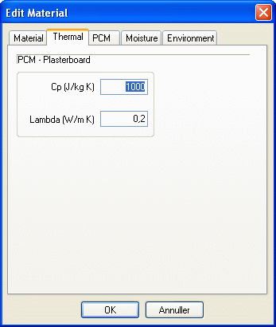

<link rel="stylesheet" href="../style.css">

# SimDB - BuildingMaterial, Thermal
The *Thermal* tab contains information on the thermal properties of the material and is displayed for all materials apart from those located in [SfB](../24Miscellaneous/24_39_SfB_in_BSim.md) groups a, b, c and 0, 1, ... .

The thermal properties are thermal capacity Cp [J/kg·K] and thermal conductivity λ [W/m·K]. This information is only used if the material forms part of a building construction (not a *WinDoor*) used in a simulation with *tsbi5* or *Bv98*.

If "Moisture Transport" is turned OFF at the "Options" tab under simulations with *tsbi5*, the lambda-value given on this tab is used. See also <a href="../07SimDB_Database/07_14_SimDB_BuildingMaterial_Moisture.md">Moisture</a>

If a new material is created in a database containing information about moisture transport in materials the moisture transport data must be given, even if a moisture transport simulation is not to be performed. <a href="../05Introduction/05_05_Limitations.md">See limitations</a>.

 

<figure id="center_img">

<figcaption>Thermal data (over and above density) for the material.</figcaption>
</figure>

See also:

*   [Tab Material](../07SimDB_Database/07_11_SimDB_BuildingMaterial_Material.md)
*   [Tab Moisture](../07SimDB_Database/07_14_SimDB_BuildingMaterial_Moisture.md)
*   [Tab Environment](../07SimDB_Database/07_07_SimDB_BuildingMaterial_Environment.md)
*   [Tab Glazing](../07SimDB_Database/07_10_SimDB_BuildingMaterial_Glazing.md)
*   [Tab UserDefined](../07SimDB_Database/07_16_SimDB_BuildingMaterial_UserDefined.md)
*   [Tab Frame](../07SimDB_Database/07_09_SimDB_BuildingMaterial_Frame.md)
*   [Tab Finish](../07SimDB_Database/07_08_SimDB_BuildingMaterial_Finish.md)
