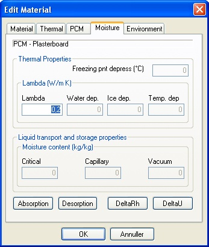

<link rel="stylesheet" href="../style.css">

# SimDB - BuildingMaterial, Moisture
The tab Moisture contains information about the moisture technical properties of the building materials.

If a new material is created in a database containing information about moisture transport in materials the moisture transport data <u>must</u> be given, even if a moisture transport simulation is not to be performed. [See limitations](../05Introduction/05_05_Limitations.md).

 

<figure id="center_img">

<figcaption>Moisture properties for building materials.</figcaption>
</figure>

On tab *Moisture* the moisture properties of a building material is given. In this tab a number of data are given, which is primarily intended for future use.

Lambda is the heat transfer coefficient for the material which is being used when the "Moisture Transport" option is turned ON at the Options tab of the simulations with tsbi5. See also "[Thermal](07_12_SimDB_BuildingMaterial_Thermal.md)".

**Only the value of Lambda is used for the time being, together with tables defined under Absorption, Desorption and DeltaRh.**

*Absorption/Desorption*: If you click the Absorption (Desorption) button, a [table is opened](../24Miscellaneous/24_43_Sorption_desorption.md). Here you can input coupled values of relative humidity (-) and moisture content (kg/kg) for points on the absorption (desorption) curve for each material. The first point is always assumed to be (0, 0), and can thus be omitted. The values must be typed in with increasing values for the relative humidity.

*DeltaRH*: Clicking the *DeltaRH* button a table is opened. Here you can input value(s) for the material curve under hygroscopic conditions as coupled values of relative humidity (-) and moisture permeability (kg/m s Pa).

 

See also:

*   [Tab Material](07_11_SimDB_BuildingMaterial_Material.md)
*   [Tab Moisture](07_14_SimDB_BuildingMaterial_Moisture.md)
*   [Tab Glazing](07_10_SimDB_BuildingMaterial_Glazing.md)
*   [Tab UserDefined](07_16_SimDB_BuildingMaterial_UserDefined.md)
*   [Tab Frame](07_09_SimDB_BuildingMaterial_Frame.md)
*   [Tab Finish](07_08_SimDB_BuildingMaterial_Finish.md)
*   [Constructing a model](../21Getting_started_with_BSim/21_01_Constructing_a_model.md)
