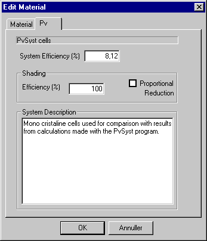

<link rel="stylesheet" href="../style.css">

# SimDB - PV-materials

<figure id="center_img">

<figcaption>Dialog for definition of building integrated solar cell systems in the database.</figcaption>
</figure>

Building integrated PV-systems are defined by a global system efficiency, which in one value describes the efficiency of the system, say incl. losses in cables, DC/AC converter, solar cells and panels. No consideration of losses due to shading should be taken into account when giving the efficiency.

Shading

*   The field *Efficiency* (*ShadEff*) allows to give an efficiency to be used when part of the PV is overshaded and **no** proportional shading reduction is being used. Normally this factor is in the magnitude of 10-20 %.

*   By putting a tick-mark in *Proportional Shading Reduction* the program will calculate the yield with a reduction proportional to the shaded area of the panels. This contradicts the common understanding that the yield is almost equal to zero when a shadow strikes a minor part of a module. In reality this can more or less be obtained by a wise cabling strategy and/or use of amorphous or thin-film cells, which are less sensitive to shading effects.

In *System Description* it is possible to give a textual explanation of the PV-system and how the overall efficiency is estimated. The field is solely an information field.