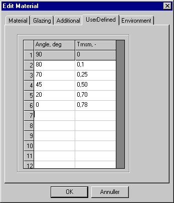

<link rel="stylesheet" href="../style.css">

# SimDB - BuildingMaterial, UserDefined
This tab allows detailed information on the dependence of transmittance on the angle of incidence to be entered and is only displayed for materials in [SfB](../24Miscellaneous/24_39_SfB_in_BSim.md) material group "a". At least three connected values for angle of incidence and transmittance have to be entered over and above the first, which is fixed. Knowing the curve for transmittance may be of particular importance if transparent insulating materials or glazing with special coatings are used, as their transmittance curve can deviate from what is familiar from ordinary building glass.

It is not possible to display the calculated curve correctly on the [*Glazing* ](07_10_SimDB_BuildingMaterial_Glazing.md)tab before the last field to be edited has been exited using the arrow keys.

<figure id="center_img">

<figcaption>Table for entering detailed information on the dependence of transmittance on the angle of incidence.</figcaption>
</figure>

See also:

*   [Tab Material](07_11_SimDB_BuildingMaterial_Material.md)
*   [Tab Thermal](07_12_SimDB_BuildingMaterial_Thermal.md)
*   [Tab Moisture](07_14_SimDB_BuildingMaterial_Moisture.md)
*   [Tab Environment](07_07_SimDB_BuildingMaterial_Environment.md)

For transparent materials in WinDoors
*   [Tab Glazing](07_10_SimDB_BuildingMaterial_Glazing.md)
*   [Tab Additional](../24Miscellaneous/24_44_SimDb_Glazing_Additional_data.md)
*   [Tab Frame](07_09_SimDB_BuildingMaterial_Frame.md)
*   [Tab Finish](07_08_SimDB_BuildingMaterial_Finish.md)
*   [MaterialLayer for WinDoor](07_05_Material_layers_for_BuildingConstruction_WinDoor.md)
