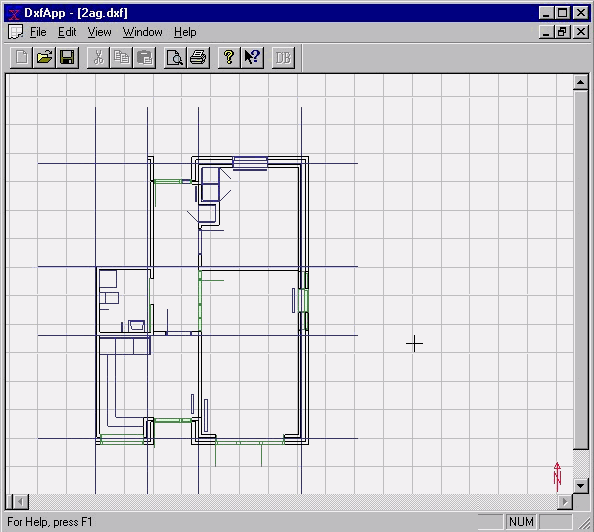

<link rel="stylesheet" href="../style.css">

# CAD drawings as a basis for geometry

*SimDXF is a simple tool for import of CAD drawings in DXF-format as base for constructing the geometric description of building models in BSim.*

 

*One floor of a multi story building can be imported via SimDXF at the time. If more floors needs to be created in the same model, it is necessary to create each floor separately and Insert the new floor(s) in the current project in SimView. Doing this the model gets more buildings (one for each new floor). It is **only** possible to simulate one building at the time (current building) in tsbi5. By dragging (in the tree structure of [SimView](../09SimView/09_01_SimView.md)) the new building(s) to the actual building, these floors (buildings) are added to the actual model and can be simulated simultaneously in [tsbi5](../13tsbi5_thermal_simulation/13_01_tsbi5_thermal_simulation.md). Occasionally it will be necessary to move the new floors (i.e. upwards) in the model, using the [Move](../09SimView/09_13_SimView_Move.md) command from the SimView-menu.*

CAD drawings of a building's floor plans can be used as the basis for constructing data models in BSim. CAD drawings must be saved in *DXF* format and should contain as little superfluous information as possible for the sake of clarity.

CAD drawings are opened in the external module called *SimDXF*, which is supplied with the software suite.

*SimDXF* is started – once the program has been set up – by clicking the icon on the toolbar and opening a *DXF* drawing.

<figure id="center_img">

<figcaption>SimDXF with a CAD drawing open.</figcaption>
</figure>

#### **Editing a face, window or door**

Select a face, window or door (click to highlight it in red), select *Edit Current* in the menu (right click + selection) or Ctrl + r. A name can be entered here if necessary and other data can be changed.

#### **Defaults - Options**

Various default values (e.g. window height) can be changed in the *Edit* | *Options* menu option.

 

#### **Saving in BSim format**

The model can be saved in a STEP file (*.dis), which can then be opened in *BSim* or *Bv98*. Please note that information on building elements does not contain details (e.g. on layering and materials). These should be taken from the database of the application in which they are to be used.

The edited DXF model can also be saved as an archive file (*.arc), which can subsequently be opened for further editing and printing of the STEP file.

It is a good idea always to save an archive file at the same time as a STEP file so that the STEP file will be easy to regenerate.

 

#### **Program version**

Via the menu entry [Help | About SimDXF ...](08_04_SimDXF_Adding_as_an_application.md) information about the program version is shown.

 

See also:

*   [Selecting the DXF filter](08_03_SimDXF_Selecting_the_DXF_filter.md)
*   [Opening a DXF drawing](08_02_SimDXF_Opening_a_DXF_drawing.md)
*   [Creating help lines](08_04_SimDXF_Adding_as_an_application.md)  <!-- TODO: verify link - no matching file found -->
*   [Creating nodes](08_09_SimDXF_Creating_nodes.md)
*   [Faces](08_05_SimDXF_Faces.md)
*   [Spaces](08_06_SimDXF_Spaces.md)
*   [WinDoor](08_08_SimDXF_WinDoor.md)
*   [Drawing revisions](08_07_SimDXF_Drawing_revisions.md)
*   [Adding SimDXF as an application](08_04_SimDXF_Adding_as_an_application.md)
