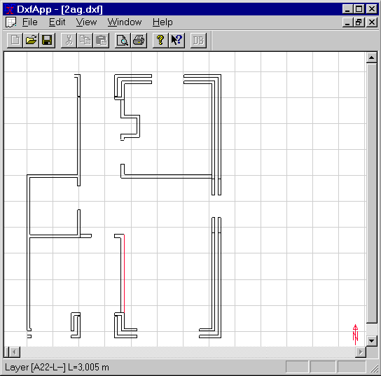

<link rel="stylesheet" href="../style.css">

# SimDXF - Opening a DXF drawing
The drawing is displayed in one window *(DXF-View)*.

<figure id="center_img">

<figcaption>Result from filtered DXF drawing.</figcaption>
</figure>

Left-click a line (the current line is highlighted in red) to display layer information and line length (at the bottom of the window).

See also:

*   [Selecting the DXF filter](../08SimDXF_CAD_drawings_as_basis_for_geometry/08_03_SimDXF_Selecting_the_DXF_filter.md)
*   [Opening a DXF drawing](../08SimDXF_CAD_drawings_as_basis_for_geometry/08_02_SimDXF_Opening_a_DXF_drawing.md)
*   [Creating help lines](../24Miscellaneous/24_48_SimDXF_Create_help_lines.md)
*   [Creating nodes](../08SimDXF_CAD_drawings_as_basis_for_geometry/08_09_SimDXF_Creating_nodes.md)
*   [Faces](../08SimDXF_CAD_drawings_as_basis_for_geometry/08_05_SimDXF_Faces.md)
*   [Spaces](../08SimDXF_CAD_drawings_as_basis_for_geometry/08_06_SimDXF_Spaces.md)
*   [WinDoor](../08SimDXF_CAD_drawings_as_basis_for_geometry/08_08_SimDXF_WinDoor.md)
*   [Drawing revisions](../08SimDXF_CAD_drawings_as_basis_for_geometry/08_07_SimDXF_Drawing_revisions.md)
*   [Adding SimDXF as an application](../08SimDXF_CAD_drawings_as_basis_for_geometry/08_04_SimDXF_Adding_as_an_application.md)