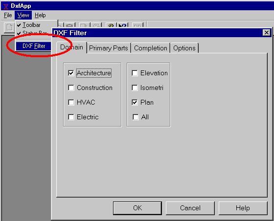
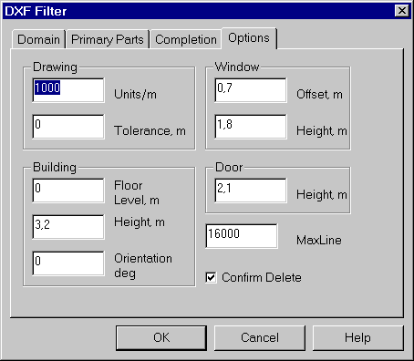

<link rel="stylesheet" href="../style.css">

# SimDXF - Selecting the DXF filter
The DXF filter can be accessed via the *<u>V</u>iew* | *DXF <u>F</u>ilter menu option* (Alt + v + f). This is where the parts of the drawing to be included can be chosen.

<figure id="center_img">

<figcaption>Choosing the DXF filter.</figcaption>
</figure>

The scale (factor for converting from the drawing's unit of measurement to metres) and tolerance (if the distance between two end points is less than the tolerance, the points are identical) are specified in *Options*.

Select the level for the floor level and storey height. It is advisable to put the top of the floor on the bottom storey at level 0, as this makes it easier to plot the other storeys.

<figure id="center_img">

<figcaption>Choosing options.</figcaption>
</figure>

*Window* | *Offset* defines the height above floor level where the bases of windows are placed in the BSim model. *Window* | *Height* defines the default height of windows created in SimDXF. *Door* | *Height* defines the default height of all doors created in SimDXF.

See also:

*   [Selecting the DXF filter](../08SimDXF_CAD_drawings_as_basis_for_geometry/08_03_SimDXF_Selecting_the_DXF_filter.md)
*   [Opening a DXF drawing](../08SimDXF_CAD_drawings_as_basis_for_geometry/08_02_SimDXF_Opening_a_DXF_drawing.md)
*   [Creating help lines](../24Miscellaneous/24_48_SimDXF_Create_help_lines.md)
*   [Creating nodes](../08SimDXF_CAD_drawings_as_basis_for_geometry/08_09_SimDXF_Creating_nodes.md)
*   [Faces](../08SimDXF_CAD_drawings_as_basis_for_geometry/08_05_SimDXF_Faces.md)
*   [Spaces](../08SimDXF_CAD_drawings_as_basis_for_geometry/08_06_SimDXF_Spaces.md)
*   [WinDoor](../08SimDXF_CAD_drawings_as_basis_for_geometry/08_08_SimDXF_WinDoor.md)
*   [Drawing revisions](../08SimDXF_CAD_drawings_as_basis_for_geometry/08_07_SimDXF_Drawing_revisions.md)
*   [Adding SimDXF as an application](../08SimDXF_CAD_drawings_as_basis_for_geometry/08_04_SimDXF_Adding_as_an_application.md)
