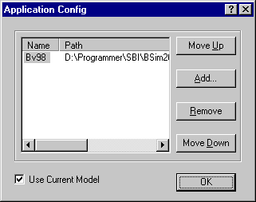

<link rel="stylesheet" href="../style.css">

# SimDXF - Adding as an application
*SimDXF* can be added to the user interface in *BSim* using the *Application* | *Setup* menu option. This opens a dialog box that allows programs to be added to or removed from the toolbar in *BSim* and the order of the attached programs can be changed.

<figure id="center_img">

<figcaption>Dialog box (Application Config) for adding programs to the toolbar in BSim.</figcaption>
</figure>

Use the *<u>A</u>dd* button to add a program to the toolbar, the *Remove* button to remove a program and the *Move up* and *Move Down* buttons to change the order of the programs on the toolbar.

See also:

*   [Selecting the DXF filter](../08SimDXF_CAD_drawings_as_basis_for_geometry/08_03_SimDXF_Selecting_the_DXF_filter.md)
*   [Opening a DXF drawing](../08SimDXF_CAD_drawings_as_basis_for_geometry/08_02_SimDXF_Opening_a_DXF_drawing.md)
*   [Creating help lines](../24Miscellaneous/24_48_SimDXF_Create_help_lines.md)
*   [Creating nodes](../08SimDXF_CAD_drawings_as_basis_for_geometry/08_09_SimDXF_Creating_nodes.md)
*   [Faces](../08SimDXF_CAD_drawings_as_basis_for_geometry/08_05_SimDXF_Faces.md)
*   [Spaces](../08SimDXF_CAD_drawings_as_basis_for_geometry/08_06_SimDXF_Spaces.md)
*   [WinDoor](../08SimDXF_CAD_drawings_as_basis_for_geometry/08_08_SimDXF_WinDoor.md)
*   [Drawing revisions](../08SimDXF_CAD_drawings_as_basis_for_geometry/08_07_SimDXF_Drawing_revisions.md)
*   [Adding SimDXF as an application](../08SimDXF_CAD_drawings_as_basis_for_geometry/08_04_SimDXF_Adding_as_an_application.md)
