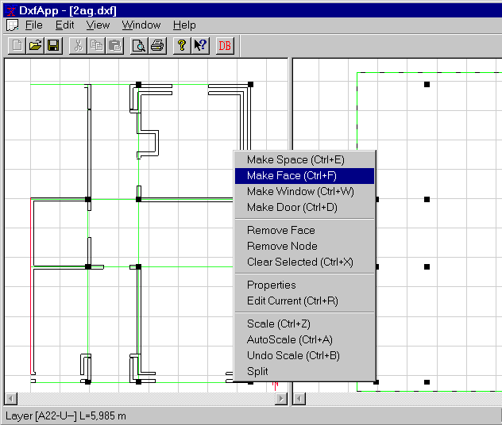

<link rel="stylesheet" href="../style.css">

# SimDXF - Faces
In *SimDXF* faces are constructed as lines between two nodes.

Select two nodes and press Ctrl+F, or draw a rectangle around the nodes between which faces are to be drawn + Ctrl+F.

<figure id="center_img">

<figcaption>Highlighting nodes for generating faces.</figcaption>
</figure>

**NOTE:** 

*   If faces are to be created around a space where the lines in the CAD-drawing are difficult to select as long centerlines, a situation can occur where it is impossible to create faces between the nodes. The reason for this is that faces can only be created between two nodes created on basis of one common line in the CAD-drawing.

*   It is possible to work around this problem by creating the nodes one-by-one (Ctrl+Q) based on two lines crosing each other. And when the next node (around the space) is to be created, to reuse one of the lines used for creating the previous node. From two nodes created from one common line, it is possible to create a face in the BSim-drawing (at the right side of the screen) by fencing (drag the mouse while pressing the left mouse button) the two nodes and pressing Ctrl+F.

Editing functions can be found in the menu called up by clicking the right mouse button. Select *Faces / Nodes* before the menu option is selected.

 

See also:

*   [Selecting the DXF filter](08_03_SimDXF_Selecting_the_DXF_filter.md)
*   [Opening a DXF drawing](08_02_SimDXF_Opening_a_DXF_drawing.md)
*   [Creating help lines](08_04_SimDXF_Adding_as_an_application.md)  <!-- TODO: verify link - no matching file found -->
*   [Creating nodes](08_09_SimDXF_Creating_nodes.md)
*   [Faces](08_05_SimDXF_Faces.md)
*   [Spaces](08_06_SimDXF_Spaces.md)
*   [WinDoor](08_08_SimDXF_WinDoor.md)
*   [Drawing revisions](08_07_SimDXF_Drawing_revisions.md)
*   [Adding SimDXF as an application](08_04_SimDXF_Adding_as_an_application.md)