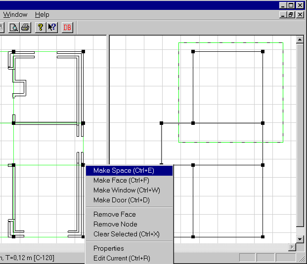
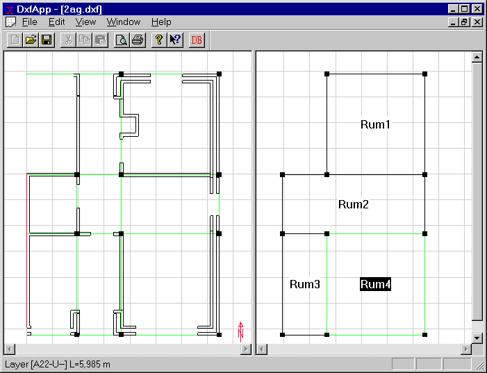

<link rel="stylesheet" href="../style.css">

# SimDXF - Spaces

Select the *faces* (select or draw a rectangle) that are to define <u>one</u> space and press Ctrl+e. Note that <u>no</u> internal walls must occur in a space.

<figure id="center_img">

<figcaption>Highlighting for creating a space.</figcaption>
</figure>

Give the *new space* a name/designation.

*A space* can be edited by right-clicking the *space* name (Properties menu (name, area and volume), add/delete faces and, where appropriate, delete the entire space). If area = volume = 0 the space is undefined, i.e. there are not enough faces to enclose the space entirely.

<figure id="center_img">

<figcaption>Model with all spaces before WinDoors are added.</figcaption>
</figure>

See also:

*   [Selecting the DXF filter](08_03_SimDXF_Selecting_the_DXF_filter.md)
*   [Opening a DXF drawing](08_02_SimDXF_Opening_a_DXF_drawing.md)
*   [Creating help lines](08_04_SimDXF_Adding_as_an_application.md)  <!-- TODO: verify link - no matching file found -->
*   [Creating nodes](08_09_SimDXF_Creating_nodes.md)
*   [Faces](08_05_SimDXF_Faces.md)
*   [Spaces](08_06_SimDXF_Spaces.md)
*   [WinDoor](08_08_SimDXF_WinDoor.md)
*   [Drawing revisions](08_07_SimDXF_Drawing_revisions.md)
*   [Adding SimDXF as an application](08_04_SimDXF_Adding_as_an_application.md)
