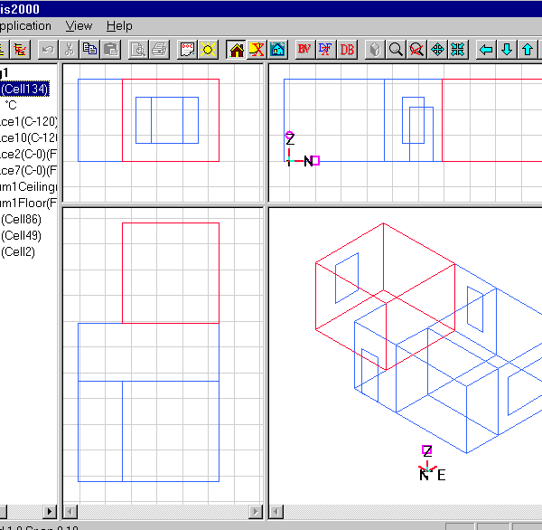

<link rel="stylesheet" href="../style.css">

# SimDXF - Drawing revisions
An archive file contains all the help lines and derived faces, windows, doors and zones. *Nodes* can be constructed from the help line. When the archive file is opened, the above information is loaded, but also the original DXF file, which is recorded together with the original help lines.

If changes have been made to the DXF file, the deviations will manifest themselves in the help lines not lying correctly. The original model can be corrected using the following method.

1.  Construct *nodes* in the old model for points that are to be moved

2.  Construct *nodes* in the new model for the equivalent points

3.  Drag *nodes* in the old model over to the equivalents in the new model.

*Nodes* can be dragged using the left mouse button (select *node* with the mouse, hold the button down and drag the *node* until it covers the *new node*, release the mouse button).

*Nodes* cannot be dragged to another *node* if it means that the width of the corresponding face will be 0. Windows and doors do not move with the face to which they belong.

<figure id="center_img">

<figcaption>Model displayed in SimView.</figcaption>
</figure>

See also:

*   [Selecting the DXF filter](08_03_SimDXF_Selecting_the_DXF_filter.md)
*   [Opening a DXF drawing](08_02_SimDXF_Opening_a_DXF_drawing.md)
*  [Creating help lines](../24Miscellaneous/24_48_SimDXF_Create_help_lines.md)
*   [Creating nodes](08_09_SimDXF_Creating_nodes.md)
*   [Faces](08_05_SimDXF_Faces.md)
*   [Spaces](08_06_SimDXF_Spaces.md)
*   [WinDoor](08_08_SimDXF_WinDoor.md)
*   [Drawing revisions](08_07_SimDXF_Drawing_revisions.md)
*   [Adding SimDXF as an application](08_04_SimDXF_Adding_as_an_application.md)
