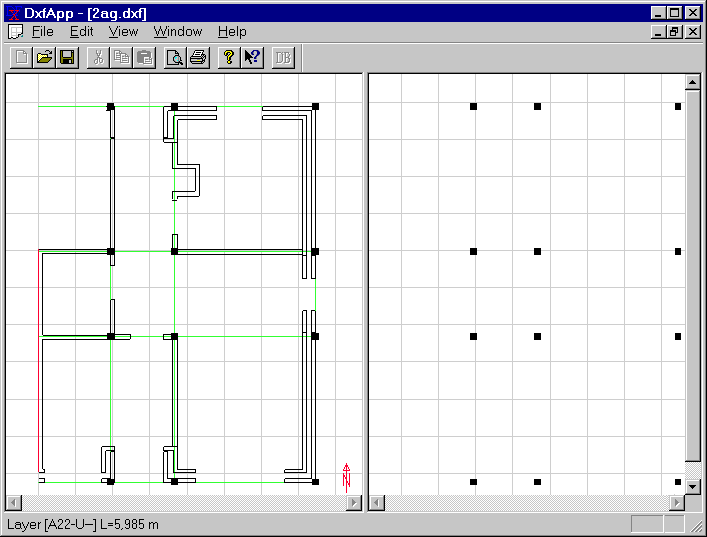

<link rel="stylesheet" href="../style.css">

# SimDXF - Creating nodes
Construct *nodes* by selecting two non-parallel lines (help lines and/or other lines) + Ctrl+Q, or draw a rectangle over the lines for which nodes are to be calculated + select Make All Nodes (right click + menu selection).

After the first node has been created the window is split in two, the original DXF view and a new SimView view, in which nodes are displayed. *SimView* represents the 3D model.

<figure id="center_img">

<figcaption>Calculated nodes.</figcaption>
</figure>

See also:

*   [Selecting the DXF filter](08_03_SimDXF_Selecting_the_DXF_filter.md)
*   [Opening a DXF drawing](08_02_SimDXF_Opening_a_DXF_drawing.md)
*   [Creating help lines](08_04_SimDXF_Adding_as_an_application.md)  <!-- TODO: verify link -->
*   [Creating nodes](08_09_SimDXF_Creating_nodes.md)
*   [Faces](08_05_SimDXF_Faces.md)
*   [Spaces](08_06_SimDXF_Spaces.md)
*   [WinDoor](08_08_SimDXF_WinDoor.md)
*   [Drawing revisions](08_07_SimDXF_Drawing_revisions.md)
*   [Adding SimDXF as an application](08_04_SimDXF_Adding_as_an_application.md)