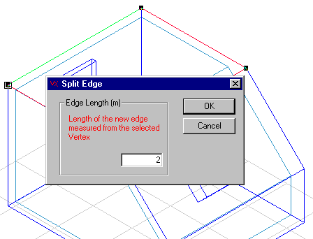

<link rel="stylesheet" href="../style.css">

# SimView - Editing the model geometry
The geometry of real buildings cannot always be described using simple boxes. It is therefore necessary to be able to edit the constructed geometry.

A face can be split by first splitting two of its *edges*. Do this by selecting an edge (easiest in the 3D view) — double-click or Shift+left-click the edge, then right-click and choose *Split Edge*. Repeat for the other edge(s) to be split. This action inserts a new vertex in the center of the edge. If one of the end points (vertices) is also selected, a dialog appears allowing the user to enter the distance from that end point to the new vertex (that is, the length of the new edge).

<figure id="center_img">

<figcaption>Split edge.</figcaption>
</figure>

A similar approach can be used for the rest of the edges that are to be split.

If two new *vertices* are selected (double-click or Shift+left-click) in the same face, an *edge* can be added between them using the *Add Edge* command from the *SimView* menu.

With this method the edges are split in the middle, which is not necessarily desired. Select the face to be subdivided (3D view or tree summary); the new and old *vertices* will be displayed as black squares. Right-clicking a *vertex* opens a dialog that allows the X, Y and Z coordinates to be edited so the vertex can be moved to the desired location.

Now the face can be split by selecting the face and the two new *vertices*, then right-clicking and choosing *Split Face*. If the geometric view with construction thickness [has been chosen](09_16_SimView_Options.md), the new face will appear with a thickness of zero because no construction has been attached. You can attach a construction to the new face as described above.

The split face will now consist of a face and an opening. You can attach face properties to the opening by selecting it and then choosing the *Add Face* option from the SimView menu.

Alternatively, select the two vertices and use the *Add Edge* option from the right-click menu to split the surface along the line connecting them.

Existing faces can also be [moved](09_13_SimView_Move.md) in parallel with the face's normal vector.

<figure id="center_img">

<figcaption>Subdividing edges and faces. The black squares mark vertices belonging to the face and can be edited by right-clicking the marking in the geometric view.</figcaption>
</figure>

See also:

*   [Creating a building](09_14_SimView_Creating_a_building.md)
*   [Creating a space](09_15_SimView_Creating_a_space.md)
*   [Default constructions](../10Thermal_zones/10_06_SimView_Default_constructions.md)
*   [Non-default constructions](09_09_SimView_Non_default_constructions.md)
*   [Creating thermal zones](../10Thermal_zones/10_01_Thermal_Zone_property.md)
*   [Systems in thermal zones](../11Systems/11_01_Systems.md)
*   [Solar light factors for WinDoors](../10Thermal_zones/10_07_Solar_light_factors_for_WinDoors.md)
*   [Adding an opening or WinDoor](../10Thermal_zones/10_08_SimView_Adding_an_opening_or_WinDoor.md)
*   [Virtual zones](09_05_Sim_View_Virtual_zones.md)
*   [Climate data and ground](09_10_Climate_data.md)
*   [Printing a model](../06BSim_Program_structure/06_07_SimView_Printing_a_model.md)
*   [SimView menu](../06BSim_Program_structure/06_06_SimView_Menu.md)
