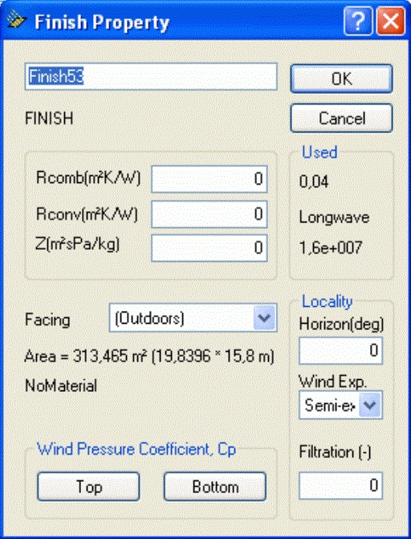

<link rel="stylesheet" href="../style.css">

# *SimView* - Virtual zones

The term virtual zones works as only those spaces located in thermal zones will be simulated in tsbi5. Virtual zones are zones, facing a real thermal zone and thus influences the conditions here. Virtual zones in BSim can be defined in two different ways:

*   1) selecting that face 2 also faces the thermal zone.

*   2) by creating a space - outside any thermal zone - with a given temperature variation or a temperature as a thermal zone.

**Re 1)** Locate the face that are facing a virtual zone. Right-click "Finish" in the tree structure on the side of a construction facing outdoors and select a thermal zone instead of "Outdoors". This creates a virtual zone that **always** have the same temperature and moisture conditions as the thermal zone. The loads on the surface facing the thermal zone are copied to the side of the virtual zone. Face 2 is thus influenced by the thermal zone, without a direct influence from face 2 on the thermal zone. If the conditions in the virtual zone is selected to be equal to the thermal zone at face 1, then the loads on the construction is symmetrical.

<figure id="center_img">

<figcaption>In the Finish Property dialog is is possible to select what is on the outdoors side of a construction.</figcaption>
</figure>

**Re 2)** If a space is created next to a real thermal zone, it can be given a fixed [temperature variation](../24Miscellaneous/24_56_Room_Temperature.md) or the same indoor conditions as a real thermal zone. If the model is **not** going to be used in Bv98, the constructions in spaces outside thermal zones do not have to be defined. If the space if given the same indoor conditions as in the neighboring zone, the construction will be subject to symmetrical loads.

When right-clicking a virtual zone (space) the dialog for definition of the thermal [properties of the space](../24Miscellaneous/24_55_Room_property.md) is shown. The temperature variation of a room outside any thermal zone can be described as a cosines shaped variation over the year.

See also:

*   [Creating a building](09_14_SimView_Creating_a_building.md)
*   [Creating a space](09_15_SimView_Creating_a_space.md)
*   [Default constructions](../10Thermal_zones/10_06_SimView_Default_constructions.md)
*   [Non-default constructions](09_09_SimView_Non_default_constructions.md)
*   [Creating thermal zones](../10Thermal_zones/10_01_Thermal_Zone_property.md)
*   [Systems in thermal zones](../11Systems/11_01_Systems.md)
*   [Editing the model geometry](09_02_SimView_Editing_the_model_geometry.md)
*   [Solar light factors for WinDoors](../10Thermal_zones/10_07_Solar_light_factors_for_WinDoors.md)
*   [Adding an opening or WinDoor](../10Thermal_zones/10_08_SimView_Adding_an_opening_or_WinDoor.md)
*   [Virtual zones](09_05_Sim_View_Virtual_zones.md)
*   [Climate data and ground](09_10_Climate_data.md)
*   [Printing a model](../06BSim_Program_structure/06_07_SimView_Printing_a_model.md)

