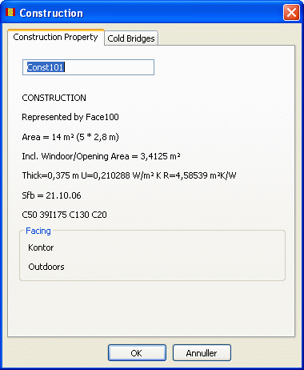

<link rel="stylesheet" href="../style.css">

# Construction Property

<figure id="center_img">

<figcaption>Construction Property.</figcaption>
</figure>

In the *Construction Property* dialog an number of information on the actual construction are found:

*   The gross area of the construction and the total area taken by windows and doors.

*   The thickness, the U-value and the surface-to-surface thermal resistance of the construction (inly if a construction type have been attached from the database).

*   The attached SfB-number from the database and the name of it.

*   Finally the name of the faces on each side of the construction are shown.

See also [Cold Bridges](09_08_Thermal_bridges.md) along the edges of a construction.
