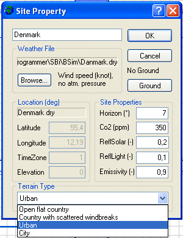

<link rel="stylesheet" href="../style.css">

# Climate data

A calculation cannot be carried out with either *tsbi5*, *XSun* or *SimLight* without an attached climate file. The climate file is attached to the building by right-clicking the building in the tree summary and clicking the *Site* button, which brings up the dialog box for selecting climate data.

<figure id="center_img">

<figcaption>Selecting or defining climate data.</figcaption>
</figure>

It is possible to search the computer manually for files containing climate data by clicking the *Browse* button. *New* has to be clicked before a climate file can be selected. At the right of the *Browse*-button, information about the content of the selected weather file is shown.

If an analysis of incident solar radiation with *XSun* is all that is to be carried out, it will be sufficient to complete the data in the Location group instead of selecting a weather data file.

If a weather data file is selected, information for the *Location* group is taken from it and the data fields are displayed in gray. The geographical position of the building is specified in *Location* using *Latitude*, *Longitude* and *TimeZone*. The time zone is positive moving eastwards, i.e. Denmark is in time zone 1. *Elevation* is the height above sea level for the station where the climate data have been measured.

The general horizon cut-off (*Horizon*), reflection of solar radiation (*SolarRad*.) and reflection of daylight (*Light*) from the surroundings can be specified in the *Ground Reflectance* group of data.

Clicking the [Ground](../24Miscellaneous/24_26_Ground.md) button opens the dialog box for defining outdoor conditions for the ground under the building.

Climate data can be [generated](../13tsbi5_thermal_simulation/13_03_Converting_weather_data_for_tsbi5.md) from a text (ASCII) file with hourly values for relevant climatic parameters.

See also:

*   [Creating a building](09_14_SimView_Creating_a_building.md)
*   [Creating a space](09_15_SimView_Creating_a_space.md)
*   [Default constructions](09_06_Construction_Property.md)
*   [Non-default constructions](09_09_SimView_Non_default_constructions.md)
*   [Creating thermal zones](../10Thermal_zones/10_01_Thermal_Zone_property.md)
*   [Systems in thermal zones](../11Systems/11_01_Systems.md)
*   [Editing the model geometry](09_02_SimView_Editing_the_model_geometry.md)
*   [Solar light factors for WinDoors](../10Thermal_zones/10_07_Solar_light_factors_for_WinDoors.md)
*   [Adding an opening or WinDoor](../10Thermal_zones/10_08_SimView_Adding_an_opening_or_WinDoor.md)
*   [Virtual zones](09_05_Sim_View_Virtual_zones.md)
*   [Climate data and ground](09_10_Climate_data.md)
*   [Printing a model](../06BSim_Program_structure/06_07_SimView_Printing_a_model.md)
