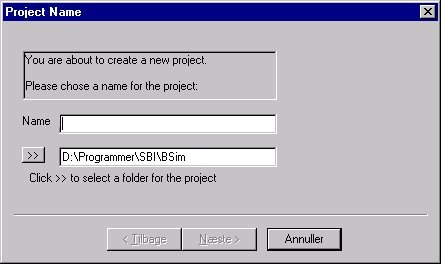

<link rel="stylesheet" href="../style.css">

# Model wizard - creating a new model
When a new model is created by clicking "New" on the toolbar or selecting "New" from the "File" menu, what is known as a *wizard*, which sets a number of default values for use when defining the model, is opened. The *wizard* goes through a number of dialog boxes:

<figure id="center_img">

<figcaption>Dialog box for naming a new project.</figcaption>
</figure>

The name chosen will also be the name of the local version of the database linked to the project. It is also possible to choose an alternative location for the project's files by clicking the double arrow ">>". A project may **not** be called "SbiData" or "data".

[Next >](../24Miscellaneous/24_52_Project_Wizard_2.md) dialog of the project wizard

Default data have now been included in the model and [a building can be created](09_14_SimView_Creating_a_building.md).

Related subjects:

*   [Creating a building](09_14_SimView_Creating_a_building.md)
*   [Creating a space](09_15_SimView_Creating_a_space.md)
*   [Default constructions](../10Thermal_zones/10_06_SimView_Default_constructions.md)
*   [Non-default constructions](09_09_SimView_Non_default_constructions.md)
*   [Creating thermal zones](../10Thermal_zones/10_01_Thermal_Zone_property.md)
*   [Systems in thermal zones](../11Systems/11_01_Systems.md)
*   [Editing the model geometry](09_02_SimView_Editing_the_model_geometry.md)
*   [Solar light factors for WinDoors](09_07_WinDoor_Property.md)
*   [Adding an opening or WinDoor](09_07_WinDoor_Property.md)
*   [Virtual zones](09_05_Sim_View_Virtual_zones.md)
*   [Climate data and ground](09_10_Climate_data.md)
*   [Printing a model](09_04_Documentation_of_model.md)

See also:
*   [SimView menu](../06BSim_Program_structure/06_06_SimView_Menu.md)