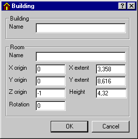

<link rel="stylesheet" href="../style.css">

# SimView - Creating a building
A building can be created or added by right-clicking in the window with the geometric model view. This calls up the *SimView* menu, where the *Add Building* option should be selected (*<u>E</u>dit* | *<u>A</u>dd* |*Building* can also be used). When a building is first created, it will contain one space. This really means that a building is created at the same time as the first space.

<figure id="center_img">

<figcaption>Dialog box for defining a building.</figcaption>
</figure>

The dialog box for creating a building contains 10 fields for entering data:

*   *Name*: The name of the building (choose a sensible name that can be recognised later!).

*   *Space Name*: The name of the space that is being created at the same time (choose a good name!).

*   *X origin*: The origin for the east axis in the non-rotated system of coordinates.

*   *Y origin*: The origin for the north axis in the non-rotated system of coordinates.

*   *Z origin*: The origin for the Z-axis (up) in the model's system of coordinates.

*   *Rotation*: The building's rotation in relation to the global system of coordinates (in degrees), clockwise is positive.

*   *X extent*: The extent of the building in the x-direction – east if the system of coordinates has not been rotated (metres).

*   *Y extent*: The extent of the building in the y-direction – north if the system of coordinates has not been rotated (metres).

*   *Height*: The height of the building (metres).

The measurements describe the location of the **system lines** in the model. When constructions are subsequently attached to the individual faces, they are plotted according to the following convention.

*   **External walls are plotted from the system line inwards.**  

*   **Internal walls are plotted with the system line as the centre line.** 

Attention **must** be paid to this convention when defining the geometry of the model.

 

See also:
*   [Creating a building](09_14_SimView_Creating_a_building.md)
*   [Creating a space](09_15_SimView_Creating_a_space.md)
*   [Default constructions](09_06_Construction_Property.md)
*   [Non-default constructions](09_09_SimView_Non_default_constructions.md)
*   [Creating thermal zones](../10Thermal_zones/10_01_Thermal_Zone_property.md)
*   [Systems in thermal zones](../11Systems/11_01_Systems.md)
*   [Editing the model geometry](09_02_SimView_Editing_the_model_geometry.md)
*   [Solar light factors for WinDoors](../10Thermal_zones/10_07_Solar_light_factors_for_WinDoors.md)
*   [Adding an opening or WinDoor](../10Thermal_zones/10_08_SimView_Adding_an_opening_or_WinDoor.md)
*   [Virtual zones](09_05_Sim_View_Virtual_zones.md)
*   [Climate data and ground](09_10_Climate_data.md)
*   [Printing a model](../06BSim_Program_structure/06_07_SimView_Printing_a_model.md)