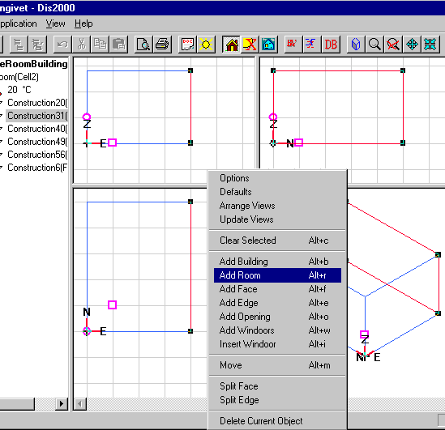
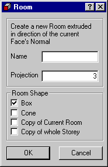

<link rel="stylesheet" href="../style.css">

# *SimView* - Creating a space

Select the face in the model that adjoins the space to be added. The face is displayed with red lines in the geometric view and highlighted in the tree summary. Right-click to call up the menu and select the *Add Space* option. This opens the dialog box for adding a space.

<figure id="center_img">

<figcaption>A face (construction) has been selected for the addition of a space. The selected construction is highlighted in the geometric view and the tree summary.</figcaption>
</figure>

<figure id="center_img">

<figcaption>Dialog box for adding a space. The three fields allow the user to specify a name (choose a good name!), how far the space should extend (in meters) from the face it is defined from (in the same direction as the face's normal vector) and four options for choosing a geometry for the space. </figcaption>
</figure>

The four geometries are *Box, Cone, Copy of Current Space* and *Copy of whole Storey*:

*   *Box* - creates a box shaped space on the exterior side (counted from the existing space) of the selected face. The distance from the selected face to the opposite face in the new space is given by the value of *Projection*.

*   *Cone* - creates a cone or a pyramid shaped space on the exterior side (counted from the existing space) of the selected face. The distance from the selected face to the top of the cone is given by the value of *Projection*.

*   *Copy of Current Room* - creates a geometric copy on the exterior side of the selected face - including WinDoors or openings in any of the faces facing the ambient - of the current space. *For the selected face an opposite face <u>must</u> exist which is parallel and has the same size and shape as the current face*.

*   *Copy of whole Storey* - creates a complete copy of all spaces with a ceiling/floor in the same level as the current face and parallel to it. For the selected face, and all faces adjacent to (directly and indirectly) it and which are parallel to it, all spaces below (or above) are copied to a new storey above (or below) as it is done for a single space using the *Copy of Current Room* function. It is thus possible to copy a whole floor plan in one operation. *Using this function in large models will cause the program to work for quite some time - so be patient. Even though this function encourage to create large models, it is always recommended to simplify the model as much as possible bearing in mind the target of the simulation. The simulation time grows proportional to the number of faces and thermal zones.*

See also:

*   [Creating a building](09_14_SimView_Creating_a_building.md)
*   [Creating a space](09_15_SimView_Creating_a_space.md)
*   [Default constructions](09_06_Construction_Property.md)
*   [Non-default constructions](09_09_SimView_Non_default_constructions.md)
*   [Creating thermal zones](../10Thermal_zones/10_01_Thermal_Zone_property.md)
*   [Systems in thermal zones](../11Systems/11_01_Systems.md)
*   [Editing the model geometry](09_02_SimView_Editing_the_model_geometry.md)
*   [Solar light factors for WinDoors](../10Thermal_zones/10_07_Solar_light_factors_for_WinDoors.md)
*   [Adding an opening or WinDoor](../10Thermal_zones/10_08_SimView_Adding_an_opening_or_WinDoor.md)
*   [Virtual zones](09_05_Sim_View_Virtual_zones.md)
*   [Climate data and ground](09_10_Climate_data.md)
*   [Printing a model](../06BSim_Program_structure/06_07_SimView_Printing_a_model.md)

