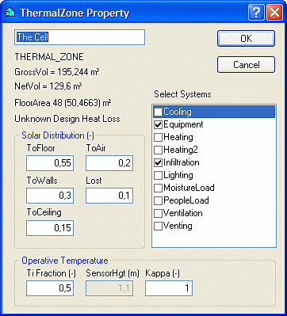

<link rel="stylesheet" href="../style.css">

# Thermal Zone property
Thermal zone as a term is virtually identical to the term zone in tsbi3. In BSim a thermal zone is one or more spaces in a building model that have been selected for simulation in tsbi5. A space has a description of geometry and constructions attached to it, whereas systems such as, for example, equipment, ventilation, heating plant, etc., can be attached to a thermal zone.

A building model consists of a number of spaces that have been described geometrically and, if necessary, thermally (constructions, windows, etc). Some of these spaces can be in thermal zones and will be included in a thermal simulation with tsbi5. Spaces that belong to the same thermal zone are therefore simulated as a single zone with the same temperature and loads.

If all the spaces in a building model are described thermally, including those outside thermal zones, the entire model can be transferred for calculation in the *[Be18 program](../07SimDB_Database/07_14_Export_calculation_options_and_templates_for_Be18.md)*. A model can therefore be used simultaneously for simple calculation in *Be18* and detailed simulation in tsbi5.

A thermal zone is created by right-clicking the building in the tree summary and clicking the Insert Thermal Zone button. Rooms are attached to thermal zones by dragging (while pressing the left mouse button) it to the desired thermal zone in the tree structure.

The dialog box for defining the global properties for thermal zones is called up by right-clicking the thermal zone in the tree summary on the left in SimView.

<figure id="center_img">

<figcaption>Dialog box for defining solar distribution and thermal stratification and attaching systems to thermal zones.</figcaption>
</figure>

Solar distribution to the floor *(ToFloor),* walls *(ToWalls)* and ceiling *(ToCeiling)* thermal zones is specified in the form of fixed quantities in the dialog box. This distribution is used if *XSun Distribution* in the parameters on the first tab during simulation with tsbi5 is **not** checked. If *XSun Distribution* is checked, on the other hand, and *longwave radiation* it turned <u>off</u> solar distribution is calculated continuously.

In this dialog box it is also possible to specify how large a proportion of the solar energy received is transferred directly to the air *(ToAir)* by striking curtains or other light furnishings, for example, and how much is lost *(Lost)* before it enters the thermal zone and can be utilized.

Calculation of the operative temperature is done by a weighting of the indoor air temperature and the average temperature of all internal surfaces. Normally these two temperatures are weighted equally, but it is possible to change this by stating the weight *(TiFraction* = 0.1 - 0.9) of the indoor air temperature (Ti).

Thermal stratification up through the thermal zone can be simulated using what is known as the "[Kappa Model](../12The_Kappa_model/12_01_The_Kappa_model.md)", in which the kappa parameter and the height above the floor *(SensorHgt)* at which the operative temperature is to be calculated can be specified. When the Kappa model is being used all systems control their behavior according to the operative temperature calculated at *SensorHgt.*

See also:

*   [Creating a building](../09SimView/09_14_SimView_Creating_a_building.md)
*   [Creating a space](../09SimView/09_15_SimView_Creating_a_space.md)
*   [Default constructions](../09SimView/09_06_Construction_Property.md)
*   [Non-default constructions](../09SimView/09_09_SimView_Non_default_constructions.md)
*   [Adding spaces to thermal zones ](10_02_SimView_Adding_spaces_to_thermal_zones.md)
*   [Systems in thermal zones](../11Systems/11_01_Systems.md)
*   [Editing the model geometry](../09SimView/09_02_SimView_Editing_the_model_geometry.md)
*   [Solar light factors for WinDoors](10_07_Solar_light_factors_for_WinDoors.md)
*   [Virtual zones](../09SimView/09_05_Sim_View_Virtual_zones.md)
*   [Climate data and ground](../09SimView/09_10_Climate_data.md)
*   [Printing a model](../09SimView/09_04_Documentation_of_model.md)