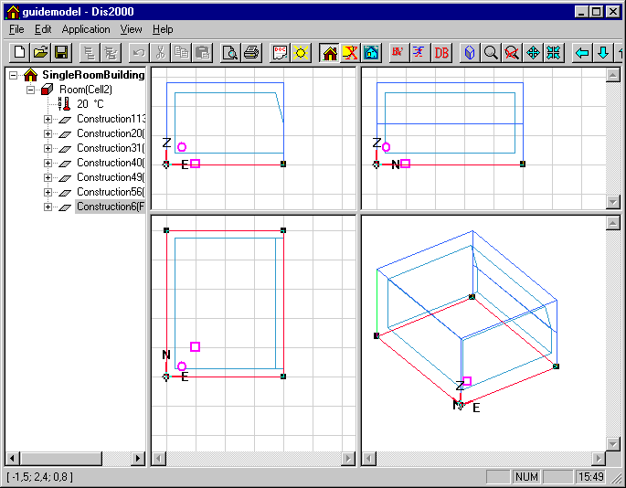

<link rel="stylesheet" href="../style.css">

# SimView - Editing the model geometry
The geometry of real buildings cannot always be described using simple boxes. It is therefore necessary to be able to edit the constructed geometry.

A face can be split by first splitting two of its *edges*. This is done by selecting the edge (easiest in the 3D view), double click or shift-left-click at the edge, right-clicking and selecting the *Split Edge* menu option. A similar procedure is used for the other edge(s) to be split. This action inserts a new vertex in th center of the edge. If one of the end points (vertexes) of the edge is selected as well, a diallog allowing the user to give the distance from that end point to the new vertx, say the lenght of the new edge:

<figure id="center_img">

<figcaption></figcaption>
</figure>

A similar approach can be used for the rest of the edges that are to be splitted.

If two new *vertices* are selected (double click or shift-left-click) in the same face, an *edge* can be added between them using the *Add Edge* command from the *SimView* menu.

With this method the edges are split in the middle, which is not necessarily what is wanted. Select the face to be subdivided (3D view or tree summary), which will cause the new and old *vertices* to be displayed as black squares. Right-clicking on a *vertex* opens a dialog box that allows the X, Y and Z-coordinates of the vertex to be edited so that it can be moved to the desired location.

Now the face can be split by selecting the face and the two new *vertices*. Right-click and select the *Split Face* menu option. If the geometric view with thickness of constructions [has been chosen](../09SimView/09_16_SimView_Options.md), a face with a thickness of zero will appear, as a construction has **not** been attached to the new face. A construction can be attached to the new face as described above.

The split face will now consist of a face and an opening. The properties of a face can be attached to the opening by selecting it and then selecting the Add Face menu option from the SimView menu.

Alternatively the two sets of coordinates, vertices, can be selected and the Add Edge option from the right-click menu used to split the surface along the line connecting the points.

Existing faces can also be [moved](../09SimView/09_13_SimView_Move.md) in parallel with the face's normal vector.

<figure id="center_img">

<figcaption>Subdividing edges and faces. The black squares mark vertices belonging to the face and can be edited by right-clicking the marking in the geometric view.</figcaption>
</figure>

See also:

*   [Creating a building](../09SimView/09_14_SimView_Creating_a_building.md)
*   [Creating a space](../09SimView/09_15_SimView_Creating_a_space.md)
*   [Default constructions](10_06_SimView_Default_constructions.md)
*   [Non-default constructions](../09SimView/09_09_SimView_Non_default_constructions.md)
*   [Creating thermal zones](10_01_Thermal_Zone_property.md)
*   [Systems in thermal zones](../11Systems/11_01_Systems.md)
*   [Editing the model geometry](10_04_SimView_Editing_the_model_geometry.md)
*   [Solar light factors for WinDoors](10_07_Solar_light_factors_for_WinDoors.md)
*   [Adding an opening or WinDoor](10_08_SimView_Adding_an_opening_or_WinDoor.md)
*   [Virtual zones](../09SimView/09_05_Sim_View_Virtual_zones.md)
*   [Climate data and ground](../09SimView/09_10_Climate_data.md)
*   [Printing a model](10_09_SimView_Printing_a_model.md)
*   [SimView menu](../06BSim_Program_structure/06_06_SimView_Menu.md)
