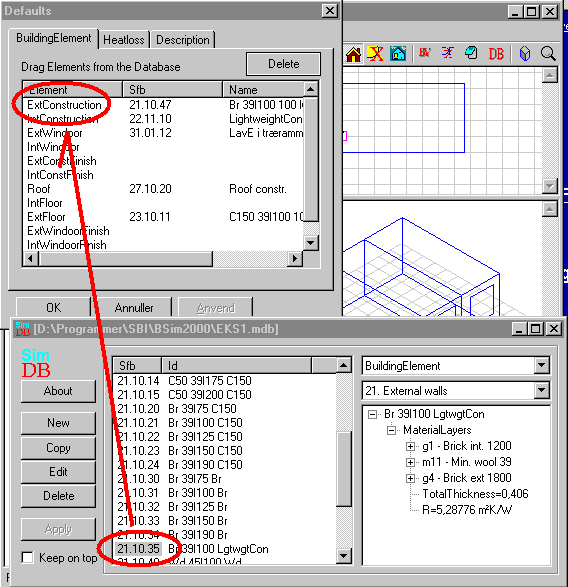

<link rel="stylesheet" href="../style.css">

# SimView - Default constructions

In *BSim* it is possible to attach default constructions to all the building elements from the *SimDB* database in one go. This is done by right-clicking in the geometric view and selecting the *Defaults* option, which opens two windows: the database and a list of different types of construction.

<figure id="center_img">

<figcaption>Attaching default constructions to building elements.</figcaption>
</figure>

*SimView* divides the constructions into groups, each of which can be given a default value from the database:

*   ExtConstructions: Constructions with one side to the open air.

*   IntConstuctions: Constructions with both sides to spaces.

*   ExtWindoor: Windows and doors with one side to the open air.

*   IntWindoor: Windows and doors with both sides to a space.

*   ExtConstFinish: Finish properties, e.g. color, gloss, etc., for faces in the open air.

*   IntConstFinish: Finish properties, e.g. color, gloss, etc., for faces in a space.

*   Roof: Constructions where the angle between the face's normal vector and the vertical is less than 30°.

*   IntFloor: Horizontal construction located between two spaces.

*   ExtFloor: Horizontal constructions whose normal vector points down.

*   ExtWindoorFinish: Finish properties for WinDoor in the open air.

*   IntWindoorFinish: Finish properties for WinDoor with a space on each side.

 

The *Delete* button allows the attachment to the database for groups of constructions to be removed. To remove the attachment, highlight a group and click *Delete.* The changes will take effect when the default constructions are updated using *Insert Defaults* by right-clicking the building.

The dialog box contains another two tabs: [HeatLoss](https://help.bsim.dk/support/kb/articles/MQvE8bmY/modeloplysninger) and [Description](https://help.bsim.dk/support/kb/articles/xmerZnQV/beskrivelse).

In addition to the constructions and [finish properties](https://help.bsim.dk/support/kb/articles/NmdKazW0/finish-property) a surface resistance is attached to all surfaces as standard.

To attach a construction from the database to one of the groups, hold the left mouse button down on the desired construction's [SfB number](../24Miscellaneous/24_39_SfB_in_BSim.md), drag the number to the Defaults window and drop it on the name of the construction group in question. Once the desired default constructions have been attached, click Apply or OK in the Defaults window. The changes will not come into force until the building is right-clicked in the tree summary and the [Insert Defaults](10_06_SimView_Default_constructions.md) button is clicked in the dialog box that appears.

Not all constructions can be defined as default constructions. In this case the constructions have to be [selected from the database individually](../09SimView/09_09_SimView_Non_default_constructions.md).

 

See also:

*   [Creating a building](../09SimView/09_14_SimView_Creating_a_building.md)
*   [Creating a space](../09SimView/09_15_SimView_Creating_a_space.md)
*   [Default constructions](10_06_SimView_Default_constructions.md)
*   [Non-default constructions](../09SimView/09_09_SimView_Non_default_constructions.md)
*   [Creating thermal zones](10_01_Thermal_Zone_property.md)
*   [Systems in thermal zones](../11Systems/11_01_Systems.md)
*   [Adding spaces to thermal zones](10_02_SimView_Adding_spaces_to_thermal_zones.md)
*   [Editing the model geometry](10_04_SimView_Editing_the_model_geometry.md)
*   [Adding an opening or WinDoor](10_08_SimView_Adding_an_opening_or_WinDoor.md)
*   [Solar light factors for WinDoors](10_07_Solar_light_factors_for_WinDoors.md)
*   [Virtual zones](../09SimView/09_05_Sim_View_Virtual_zones.md)
*   [Climate data and ground](../09SimView/09_10_Climate_data.md)
*   [Printing a model](10_09_SimView_Printing_a_model.md)
