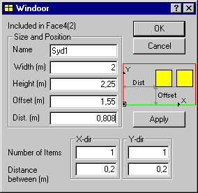

<link rel="stylesheet" href="../style.css">

# *SimView* - Adding an opening or WinDoor

Faces do not only consist of non-translucent parts, they also include openings, windows and doors. A new term has been introduced in *BSim*. This term covers both windows and doors, as they behave the same in simulation contexts. Openings are dealt with under the same heading because their geometric position is defined in the same way and a *WinDoor* is basically added in an opening.

The position in a face is chosen by first selecting a corner point (*vertex*) in the face – normally the point in the face with the smallest x or y-coordinate in the direction of the face. A vertex is selected by left-clicking a vertex in the 3D-view while pressing the Shift--button. Alternatively you can double left-click, without activating the Shift-button. This point becomes the origin in a temporary, local system of coordinates in which the opening or WinDoor is positioned. A selected point is displayed as a black square with a black frame around it. An *edge* – normally the bottom of the face – also has to be selected as the local x-axis from which to define the position. Selection of an edge is made similar to the procedure described above for a vertex. A selected edge is displayed as a green line.

Then right-click in the geometric view and select the *Add Opening* or *Add WinDoor* menu option to open the dialog box for defining the position in the face.

<figure id="center_img">

<figcaption>Dialog box for positioning a WinDoor in a face.</figcaption>
</figure>

Various data have to be entered to ensure clear positioning:

*   *Name:* The name of the opening or window (choose a good name!).
*   *Width:* The width in meters.
*   *Height:* The height in meters.
*   *Offset:* The displacement in relation to the selected edge (green) in meters. If the bottom edge of the face is selected, it is a vertical displacement in relation to the bottom of the face (often the floor).
*   *Dist:* Displacement in parallel to the selected edge in meters.
*   *Number of Items:* The number of identical openings or WinDoors in the face in the two directions (X and Y) shown at the small illustration in the dialog.
*   *Distance between:* If more than one object is to be entered in either the X or the Y direction, their mutual spacing has to be specified in meters.

Windows and openings cannot be positioned right at the edge of constructions that adjoin the face in which the window or aperture is to be inserted. If OK is clicked and the tolerance has been exceeded, the menu is exited without an object being inserted. If, on the other hand, *Apply* is clicked, the software will try to insert the desired object. If the position is outside the tolerances, insertion will not succeed and the input data can be changed.

Every time *Apply* is clicked, an object *(Opening* or *WinDoor)* with the specified geometry is added. It is therefore a good idea to create all openings and *WinDoors* belonging to the same face from this dialog box in one go.

If a WinDoor is to be placed in the center of a surface with the same distance to all edges, the [Insert Windoor](../24Miscellaneous/24_30_SimView_Insert_WinDoor.md) function should be used instead.

The geometric description of a WinDoor (frames, bars, overhang and side fins together with connected systems - shutters and solar shading) is entered by right-clicking the object in the tree summary, which opens the [Windoor Property](../09SimView/09_07_WinDoor_Property.md) dialog box.

A specific window is attached to the model by dragging it from the [database](../07SimDB_Database/07_05_Material_layers_for_BuildingConstruction_WinDoor.md)to the right place in the model's tree summary.

Systems connected to WinDoors:

*   [Regulation](../24Miscellaneous/24_62_Regulation.md)
*   [Shutter](../11Systems/11_15_Systems_shutter.md)
*   [SolarShading](../11Systems/11_16_Systems_shading.md)

See also:

*   [Creating a building](../09SimView/09_14_SimView_Creating_a_building.md)
*   [Creating a space](../09SimView/09_15_SimView_Creating_a_space.md)
*   [Default constructions](10_06_SimView_Default_constructions.md)
*   [Non-default constructions](../09SimView/09_09_SimView_Non_default_constructions.md)
*   [Creating thermal zones](10_01_Thermal_Zone_property.md)
*   [Systems in thermal zones](../11Systems/11_01_Systems.md)
*   [Editing the model geometry](../09SimView/09_02_SimView_Editing_the_model_geometry.md)
*   [Solar light factors for WinDoor](10_07_Solar_light_factors_for_WinDoors.md)
*   [Adding an opening or WinDoor](10_08_SimView_Adding_an_opening_or_WinDoor.md)
*   [Virtual zones](../09SimView/09_05_Sim_View_Virtual_zones.md)
*   [Climate data and ground](../09SimView/09_10_Climate_data.md)
*   [Printing a model](10_09_SimView_Printing_a_model.md)