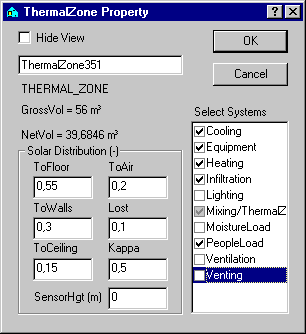

<link rel="stylesheet" href="../style.css">

# *SimView* - Systems

A system consists of the general physical component, described by a simple mathematical model, and a schedule, which specifies variations, control strategies, etc., described by connected pairs of control and time definition, cf. figure.

<figure id="center_img">

<figcaption>General description of systems.</figcaption>
</figure>

All systems in *BSim* are controlled on the basis of an operative temperature in the thermal zone to which they are attached.

All the installations and loads that impact on the thermal indoor climate must be defined for a building model. In what follows they are all covered by the term components.

Components are described by simplified models of the physical installations, loads, etc. The relevant variations, control strategies, etc., are described separately as a *control action* on the component. By way of an example, [people load](https://bsim.outseta.com/support/kb/articles/XQYdjgmP/personer), i.e. the heat and moisture load from people in a zone, is described as the maximum number of people of a given type, is specified as one person's heat and moisture emissions at a given activity level. Variations in the people load over the year and day are specified as a control action, in this instance a day profile, i.e. a percentage daily variation in the people load.

The following table provides a summary of elements with their possible attached components and control actions. In cases where a component can have more than one type of control, control types that can be used when choosing the control action are also specified.

One or no component of a given type can be specified for each system in a building model. In cases where a component has been selected, the control action on the component is specified using a [schedule](https://bsim.outseta.com/support/kb/articles/79O3DZ9E/systemer---tidsplan). A schedule generally consists of one or more pairs of *control* and [time definition](http://bsim.outseta.com/support/kb/articles/VmAOwo9a/tidsangivelse). The control action specifies how the component is to be controlled or modified at the times that fall within the relevant time definition.

The combination of a component and its schedule is called a *system* and defines the impact on the building in terms of indoor climate at any time during a simulation.

| **Element**      | **Component** | **Control** | **Type** |
|--------------|--------|--------|--------|           
| **Zone**         |                                                                            |                                                                                                                   |                         |
|              | [People load](https://bsim.outseta.com/support/kb/articles/XQYdjgmP/personer)       | [Day profile](https://bsim.outseta.com/support/kb/articles/L9PwDAQJ/dognprofil)                                      | -                       |
|              | [Equipment load](http://bsim.outseta.com/support/kb/articles/vW5a8pW4/udstyr)        | [Day profile](https://bsim.outseta.com/support/kb/articles/L9PwDAQJ/dognprofil)                                      | -                       |
|              | [Moisture load](https://bsim.outseta.com/support/kb/articles/xmere5QV/fugt)          | [Day profile](https://bsim.outseta.com/support/kb/articles/L9PwDAQJ/dognprofil)                                      | -                       |
|              | [Infiltration](http://bsim.outseta.com/support/kb/articles/Rm8JRZ94/infiltration)    | [Day profile](https://bsim.outseta.com/support/kb/articles/L9PwDAQJ/dognprofil)                                      | -                       |
|              | [Lighting](http://bsim.outseta.com/support/kb/articles/wQXxbnQK/belysning)           | [Lighting control](http://bsim.outseta.com/support/kb/articles/wQXxbnQK/belysning)                                   | Sun / temperature      |
|              |                                                                            | [Daylight control](http://bsim.outseta.com/support/kb/articles/wQXxbnQK/belysning)                                   | Daylight               |
|              | [Venting](http://bsim.outseta.com/support/kb/articles/wQXxbnQK/belysning)           | [Venting control](http://bsim.outseta.com/support/kb/articles/wQXxbnQK/belysning)                                    | -                       |
|              | [Heating](http://bsim.outseta.com/support/kb/articles/wmjnq7mV/opvarmning)          | [Heating](http://bsim.outseta.com/support/kb/articles/wmjnq7mV/opvarmning)-/cooling control                           | Radiator               |
|              |                                                                            | [Floor heating control](http://bsim.outseta.com/support/kb/articles/L9nr6e9Z/gulvvarmeregulering)                     | Floor heating          |
|              | [Cooling](http://bsim.outseta.com/support/kb/articles/y9gBNGQM/koling)              | Heating-/[cooling control](http://bsim.outseta.com/support/kb/articles/y9gBNGQM/koling)                              | -                       |
|              | [Ventilation system](http://bsim.outseta.com/support/kb/articles/OW4N5AQg/ventilation) | [Supply control](http://bsim.outseta.com/support/kb/articles/OW4N5AQg/ventilation)                                   | Supply                 |
|              |                                                                            | [Room temperature control](http://bsim.outseta.com/support/kb/articles/DQ2x0yWV/ventilation---rumtemperaturregulering) | Room temperature       |
|              |                                                                            | [Moisture control](http://bsim.outseta.com/support/kb/articles/E9LwjGQw/ventilation---fugtregulering)                 | Moisture               |
|              |                                                                            | [VAV control](http://bsim.outseta.com/support/kb/articles/j9b8kamn/ventilation---vav-regulering)                     | VAV                    |
|              |                                                                            | [Night cooling](http://bsim.outseta.com/support/kb/articles/L9nrXz9Z/ventilation---natkoling-ventilation)            | Night cooling          |
|              |                                                                            | [Return air](http://bsim.outseta.com/support/kb/articles/LmJvMEmP/ventilation---recirkulation)                        | Recirculation of air   |
|              | [Mixing](http://bsim.outseta.com/support/kb/articles/Rm8JEd94/mixing)            | [Day profile](https://bsim.outseta.com/support/kb/articles/L9PwDAQJ/dognprofil)                                      | .                      |
| **WinDoor**      |                                                                            |                                                                                                                   |                         |
|              | [Shutters](http://bsim.outseta.com/support/kb/articles/ZmNrMxm2/skodde)           | [Temperature control](http://bsim.outseta.com/support/kb/articles/ZmNrMxm2/skodde)                                   | -                       |
|              | [Shading](http://bsim.outseta.com/support/kb/articles/7maw8X9E/solafskarmning)     | [Shading control](http://bsim.outseta.com/support/kb/articles/7maw8X9E/solafskarmning)                               | -                       |
| **Virtual zone** |                                                                            |                                                                                                                   |                         |
|              | -                                                                          | Temp./moisture variation                                                                                             | -                       |

*Summary of elements in the building model to which systems consisting of a component and a schedule can be attached.*

Systems can be attached to thermal zones and selected by "checking" them in the *ThermalZone* Property dialog box, which is opened by right-clicking the icon for a thermal zone in the tree summary on the left of the screen. Control and schedule then have to be defined for the selected systems.

<figure id="center_img">

<figcaption>Dialog box for selecting, deactivating and deselecting systems to be attached to a thermal zone.</figcaption>
</figure>

The check boxes next to the individual systems have three functions:

*   The first time an empty box is clicked, the system is added to the thermal zone, with this being indicated by a black tick in a white box, e.g. *Cooling, Equipment* and *Heating.* The system appears in the tree summary <u> without </u> a "+" in front of it as long as a schedule has not been defined.

*   The second time the box is clicked, the system is deactivated in the tsbi5 simulation, with this being indicated by a grey tick in a grey box, e.g. Mixing. When a system has been deactivated it will <u>not</u> be checked for faults and will not appear in [ModelList](https://bsim.outseta.com/support/kb/articles/z9MKj7m4/udskrift-af-model) The system is displayed in the tree structure as the existing icon with a red cross through it..

*   At third click in the box, the tick mark is removed and the box left empty. When OK is pressed, existing systems without tick-marks, will be suggested deleted as systems for the thermal zone.

The selected systems are displayed as sub-items under the thermal zone in the tree summary. The order that the systems occurs in the tree structure is the same as the order in the tsbi5 simulation. If the order need to be changed, it can be done by dragging one system to the system that is to follow the current.

<figure id="center_img">

<figcaption>The systems are displayed as sub-items under the thermal zone.</figcaption>
</figure>

In the user interface this structure is reflected in the dialog boxes for the individual components, with all components having a [Schedule](https://bsim.outseta.com/support/kb/articles/79O3DZ9E/systemer---tidsplan) tab, which can be selected to define the schedule to be used for the specific component. In the *Schedule* dialog box the schedule is displayed as a connected pair of [time definition](http://bsim.outseta.com/support/kb/articles/VmAOwo9a/tidsangivelse) and control.

The order of the control/schedule pairs in the summary dialog box is very important, with it being used in a simulation to determine which control action has to be used together with the particular component. At a given time (at the beginning of each hour) the schedule is run through in the order in which it is shown on the summary tab *(Schedule).* In the case of the first pair where the specified time falls within the time definition, the relevant control action will be used together with its component. If, of the other hand, the specified time does not fall within any time definition in the schedule, the relevant component will not be activated at all, i.e. there will be no impact on indoor climate at the time in question.

Once the desired systems have been added to the thermal zone, the definitions can be edited by right-clicking the system in the tree summary. This opens a dialog box for defining the particular system.

Two types of system, which are selected via the respective options in the WinDoor dialog box, can be attached to a WinDoor: shutters and shading. It is also possible to enter information on solar light factors affecting daylight conditions in connection with control of the lighting system.

See also:

*   [Tab *Schedule*](http://bsim.outseta.com/support/kb/articles/79O3DZ9E/systemer---tidsplan)
*   [Tab *Time*](http://bsim.outseta.com/support/kb/articles/VmAOwo9a/tidsangivelse) 
*   [Control priority for systems](https://bsim.outseta.com/support/kb/articles/BWzd8lQE/reguleringsprioritet-for-systemer)

Systems (no control) connected to the building model:
*   [Shadows from surroundings](https://bsim.outseta.com/support/kb/articles/E9LwJGQw/skygger-fra-omgivelser)

Systems connected to thermal zones:
*   [Mixing](http://bsim.outseta.com/support/kb/articles/Rm8JEd94/mixing)
*   [Persons](http://bsim.outseta.com/support/kb/articles/XQYdjgmP/personer)
*   [Equipment](http://bsim.outseta.com/support/kb/articles/vW5a8pW4/udstyr)
*   [Moisture](http://bsim.outseta.com/support/kb/articles/xmere5QV/fugt)
*   [Infiltration](http://bsim.outseta.com/support/kb/articles/Rm8JRZ94/infiltration)

*   [Lighting](http://bsim.outseta.com/support/kb/articles/wQXxbnQK/belysning)
*   [Venting](http://bsim.outseta.com/support/kb/articles/gWKDJlmp/udluftning)
*   [Heating](http://bsim.outseta.com/support/kb/articles/wmjnq7mV/opvarmning)
*   [Cooling](http://bsim.outseta.com/support/kb/articles/y9gBNGQM/koling)
*   [Ventilation](http://bsim.outseta.com/support/kb/articles/OW4N5AQg/ventilation)

To a WinDoor two types of systems can be selected via their respective entries in the WinDoor dialog: [Shutter ](http://bsim.outseta.com/support/kb/articles/ZmNrMxm2/skodde)and [Shading](http://bsim.outseta.com/support/kb/articles/7maw8X9E/solafskarmning). In additions to this, information about solar light factors concerning daylight conditions can be defined in connection to the control of the system [Lighting](http://bsim.outseta.com/support/kb/articles/wQXxbnQK/belysning).

Systems connected to WinDoor:
*   [Shutter](http://bsim.outseta.com/support/kb/articles/ZmNrMxm2/skodde)
*   [Shading](http://bsim.outseta.com/support/kb/articles/7maw8X9E/solafskarmning)
