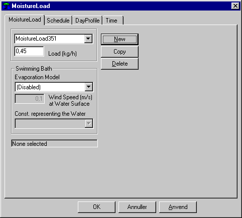

<link rel="stylesheet" href="../style.css">

# Systems, *Moisture*
Dialog box for specifying moisture load in the current thermal zone, apart from moisture from people.

The software's [standard model](../20The_Mathematical_basis/20_04_Moisture_balance_for_a_zone.md) for moisture calculations is very simple, with no account being taken of moisture absorption and adsorption by the space's surfaces or moisture transport and moisture accumulation in materials. This phenomenon can be dealt with in the module for detailed simulating of the [hygro-thermal conditions](../20The_Mathematical_basis/20_05_Detailed_model_for_moisture_transport.md) in a thermal zone.

<figure id="center_img">

<figcaption>Dialog box for defining moisture load.</figcaption>
</figure>

It is possible to select among two different functions for moisture liberation in the thermal zone. At the top of the dialog the user can choose a steam humidification, which is independent of the indoor climate condition (temperature and moisture content) of the thermal zone. At the bottom of the dialog it is possible (from BSim version 2002) to choose a moisture liberation analogue to the one found from a free water surface, i.e. in an indoor swimming pool. Only one of the two moisture liberation functions can be active.

*Load*

*   *Load specifies the release of moisture to the room air from all load sources in the space apart from people [kg/hour].*

*Swimming Bath* (from BSim version 3.2.7.25)

*   Two functions, *Shah* or *Smith* can determine the moisture liberation. Both functions depend among others on the air velocity atthe water surface. When choosing *Disabled* one collective moisture liberation will be used as described under *Load.*

*   The air velocity parallel to the water surface is given as the average value over the time definition. The value is corrected according to the selected day profile. The air velocity is not used in the Shah model.

*   Under Cons. *Representing the Water* the construction representing the water surface must be selected.

The moisture liberation is calculated according to the equations below:

| Model | Unused | Used by N persons | Conditions |
|------|-----------|------------------------|------------|
| **Shah** | $E = \frac{1}{3600} C_{p,w} (\rho_a - \rho_w)^{\frac{1}{3}} (W_w - W_a)$ | $E = E_0 \left( 14.85 \frac{N}{A} + 1 \right)$ | $A/N \ge 45$ |
|  |  | $E = E_0 \left( 5.85 \frac{N}{A} + 1.2 \right)$ | $4.5 < A/N < 45$ |
|  |  | $E = 2.5 E_0$ | $A/N \le 4.5$ |
| **Smith** | $E = \dfrac{0.73(0.0888 + 0.0783V)\sqrt{P_w - P_a}}{h_w}$ | $E = E_0 \left( 4.27 \frac{N}{A} + 1.04 \right)$ |  |

For the number of persons N is used the number of persons defined for the thermal zone under [PeopleLoad](11_13_Systems_Persons.md).

where:

|            |                                                                                              |
|-----------------------|------------------------------------------------------------------------------------------------------------|
| A                     | Area of water surface, [m²]                                                                              |
| C                     | C = 35 for (ρa - ρw) > 0,02 C = 40 for (ρa - ρw) ≤ 0,02  if (ρa - ρw) < 0, its absolute value is used. |
| E                     | Moisture liberation [kg/m²/s]                                                                                   |
| E0                    | Moisture liberation from unused pool [kg/m²/s]                                                               |
| Pw , Pa                | Saturated water pressure of the air at the temperature of the pool and the water pressure of the air [Pa].               |
| V                     | Air velocity parallel to the water surface [m/s]                                                           |
| Ww , Wa                | Absolute moisture content of the air at the water surface and air temperature respectively [kg/kg]                  |
| hw                    | The latent heat of vaporisation of water [J/kg].                                                     |
| ρw , ρa                | Density of the air at the water and air temperature respectively [kg/m³]

 

The moisture and air balances are described in greater detail in [the mathematical basis](../20The_Mathematical_basis/20_01_The_Mathematical_basis.md).

[The schedule](11_02_Systems_schedule.md) defines connected sets of control and [time definition](11_17_Systems_Time.md). "Moisture load" control is of the [day profile](11_04_Systems_DayProfile.md) type, with the variation over the hours of the day being specified in percent.

See also:
*   Tab [Schedule](11_02_Systems_schedule.md)
*   Tab [DayProfile](11_04_Systems_DayProfile.md)
*   Tab [Time](11_17_Systems_Time.md)
