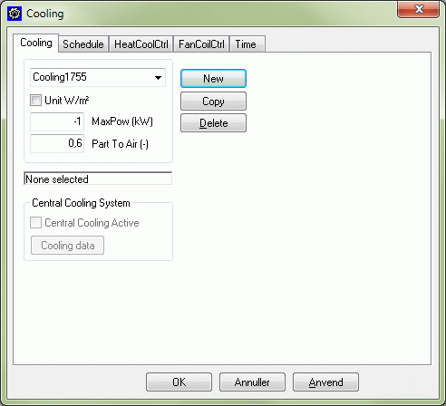

<link rel="stylesheet" href="../style.css">

# Systems, *Cooling*
The model simulates a thermostat-controlled cooling radiator, e.g. a cooling ceiling or other cooling surface placed in the current thermal zone. The model corresponds to that described under heating. The function here is to cool the space, however, i.e. where there is a tendency towards excess temperature in the thermal zone, to control the cooling output in such a way that the temperature is kept at the selected cooling set point as far as possible.

<figure id="center_img">

<figcaption>Dialog box for defining cooling radiator.</figcaption>
</figure>

*Unit:* By placing a "tick" mark next to *Unit,* it is possible to change from inputting the absolute amount of installed power in the thermal zone to amount of installed power per m² floor area. This is especially useful if the same heating system is to be used (copied) in more thermal zones with varying heat loss.

*Max Power* is the maximum cooling power that can be "given off" by the cooling surface. The power must be entered as a negative number. The available cooling output is controlled on the basis of the outdoor temperature, with the (numerical) maximum value being achieved at the design outdoor temperature in summer.

*Part To Air* is the proportion of the cooling output that is reckoned to be given off to the room air by convection. The remainder is supplied to the surfaces of the constructions in the zone's faces by radiation.

Central Cooling System indicates that the cooling power for the system comes from a centralt cooling system. The central cooling system can not be activated as a source for the cooling system until the external program PackCalc have been installed. [PackCalc](../24Miscellaneous/24_01_PackCalc.md) has been developed by IPU Teknology development at Danish Technical University (DTU) and can be downloaded from their [web]() site.

Cooling data opens a dialog for input data for the cooling system.

In the [schedule]() a list of connected sets of controls and time definitions are found.

See also:
*   Tab *[HeatCoolCtrl](11_09_Systems_cooling.md)*
*   Tab *[Schedule](11_02_Systems_schedule.md)*
*   Tab *[Time](11_17_Systems_Time.md)*

