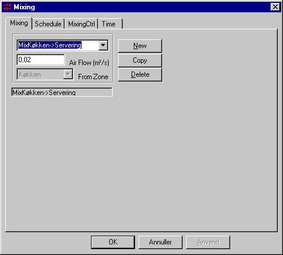

<link rel="stylesheet" href="../style.css">

# Systems, *Mixing*
Mixing is defined as air exchange between thermal zones and spaces in the model. It is not possible to mix <u>from</u> a space defined as having the same temperature as the thermal zone the mixed air flow is going into.

*Air Flow* specifies the air flow into the current thermal zone from the zone specified in *From Zone*.

<figure id="center_img">

<figcaption>Mixing for a thermal zone consists of an air flow in m³ per second and a thermal zone or space from which the air comes.</figcaption>
</figure>

*Air Flow* is the size of the air flow entering the thermal zone.  

*From Zone* indicates from which thermal zone or room the air flow enters the actual thermal zone.

**Note:** Any unbalanced air-flows (from any system influencing the air-flow in a thermal zone) will be balanced automatic in tsbi5 by infiltration or exfiltration to the outdoor - no matter if the thermal zone is completely surrounded by other rooms or thermal zones.

**Note:** It is possible to select mixing from a fictive zone (a room with the same thermal conditions as a real thermal zone, but not part of the simulation) adjacent to the thermal zone to receive the air-flow. It is though <u>not</u> possible to have more than one mixing from any thermal zone, and a fictive zone is considered as being the same as the thermal zone that it have the same conditions as. Therefore, mixing will <u>only</u> occur from the real thermal zone.

Using the [control action]() it is possible to control a desired heat (or cold) transfer from an adjoining zone to the current zone. Mixing is controlled on/off with a percentage of the air flow defined in the relevant day profile.

See also:
*   [Tab MixingCtrl](11_10_systems_mixing.md)   
*   [Tab Schedule](11_02_Systems_schedule.md)   
*   [Tab Time](11_17_Systems_Time.md)