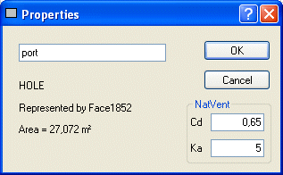

<link rel="stylesheet" href="../style.css">

# Naturlig ventilation, System
*The module to simulate natural ventilation using the multi-zone model (mzm) is for the time being in beta test and results obtained using this module must, as always, be looked upon with natural skepticism.*

*Any feed-back to the module given at bsim-support@sbi.dk is appreciated!*

 

The page is under construction! 

Simulation of natural ventilation using the module for BSim requires input to the model in various places.

*   Site
*   Finish
*   Opening
*   WinDoor
*   Venting
*   VentingCtrl
*   New result

Natural ventilation can be activated on thermal zone level.

In the simulations only WinDoors/Openings facing the ambient are taken into account. The most suitable model can be identified automatically by BSim.

Natural ventilation is implemented as a special kind of Venting (airing) in an expansion module of BSim, and is based on [By og Byg (SBi) Direction 202](https://bsim.outseta.com/support/kb/articles/yW1xrD9B/uddrag-fra-by-og-byg-anvisning-202), Natural ventilation in commercial buildings, Calculation and dimensioning (2002).

#### **Input for natural ventilation**

**Site**

<figure id="center_img">

<figcaption>Input connected to the simulation of natural ventilation at the Site dialog are CO2 concentration of the ambient air and terrain type.</figcaption>
</figure>

*   *Weather File:* The weather data file must contain information about the wind speed to make a simulation of natural ventilation. At the right of the *Browse-button,* information about the content of the selected weather file is shown.

*   *Co2:* Concentration of CO2 in the ambient air (for the time being constant) is given as a property for the location of the building model.

*   *Terrain Type*: The terrain type is selected ([Direction 202, page 35](https://bsim.outseta.com/support/kb/articles/A93zbqQ0/litteratur)) from the list:
    *   Open flat country,
    *   Country with scattered windbreaks,
    *   Urban,
    *   City.

**Finish**

<figure id="center_img">

<figcaption>In the Finish Property dialog, simulation of natural ventilation is connected to 'Wind Exposure'.</figcaption>
</figure>

*   Wind Exposure gives the local wind conditions for a wall facing the ambient. The condition is selected from the list:

    *   Semi-exposed: Surrounding buildings or other wind breakers are half the height of the actual wall (default value).

    *   Exposed: The wall is completely exposed for the wind.

    *   Sheltered: Surrounding buildings or other wind breakers are of the same height as the wall.

**Opening**

<figure id="center_img">

<figcaption>In the Opening Property dialog, natural ventilation is connected to the Cd-value.</figcaption>
</figure>

*   *Cd:* The air [discharge coefficient Cd](https://help.bsim.dk/support/kb/articles/DmwAjy94/parametre-til-naturlig-ventilation) is found according to [Direction 202, page 70-71](https://bsim.outseta.com/support/kb/articles/A93zbqQ0/litteratur). Typical values range from 0.62 to 0.70.

*   *[Ka](https://help.bsim.dk/support/kb/articles/DmwAjy94/parametre-til-naturlig-ventilation):* This parameter is being used for calculation of the penetration depth of outside air in a room and thus the part of the ceiling that is directly influenced by outdoor air entering the room through a opening.

In the simulations the full (geometrical) area of the opening is used.

**Windoor**

<figure id="center_img">

<figcaption>Input for simulating natural ventilation is located at the Natural Ventilation tab of the Windoor property dialog.</figcaption>
</figure>

*   *Cd:* The air [discharge coefficient Cd](https://help.bsim.dk/support/kb/articles/DmwAjy94/parametre-til-naturlig-ventilation) is found according to Direction [202, page 70-71](https://bsim.outseta.com/support/kb/articles/A93zbqQ0/litteratur). Typical values range from 0.62 to 0.70.

*   *Cnt:* The center of the opening (0-1) is located in the distance Cnt*H above the lower edge of the window, where H is the height of the window. The width of the opening is assumed to be equal to the width of the window.

*   *Afrac:* The fraction of the actual window area that can be opened. If *Afrac* = 0 the window can not be opened, and can thus not contribute to the natural ventilation of the thermal zone.

    *   The sketch at the right illustrates BSim's perception of the opening and the input data.

*   *Ka:* This [parameter](https://help.bsim.dk/support/kb/articles/DmwAjy94/parametre-til-naturlig-ventilation) is being used for calculation of the penetration depth of outside air in a room and thus the part of the ceiling that is directly influenced by outdoor air entering the room through a opening.

As wind pressure coefficients - that depends on the orientation and the wind direction of the openings - values are used according to [Direction 202, Appendix A, page 109-110.](https://bsim.outseta.com/support/kb/articles/A93zbqQ0/litteratur)

 

**Venting**

<figure id="center_img">

<figcaption>In the definition the system Venting, natural ventilation is connected to the fields "Max AirChange" and "Max Wind" plus the selection menu "Natural Ventilation".</figcaption>
</figure>

*   *Max AirChange*: Maximum acceptable air-change (/h).

*   *Max Wind:* No natural ventilation if the wind speed (m/s) is larger than the given limit. If 0 m/s is given, natural ventilation can occur at any wind speed.

*   *Natural Ventilation:* The desired model is selected from the selection menu found under Natural Ventilation. Above the list the name of the model selected by BSim is shown. The following options are available: 

    *   *(Disabled)*: The original BSim venting model.

    *   *(Automatic):* BSim selects the model to use from the geometry of the room, see the [mathematical background](https://help.bsim.dk/support/kb/articles/xmerqBQV/naturlig-ventilation) for illustrations of model geometries equal to the selections shown below.

    *   *Single Sided*: One set of openings in one face, in same vertical level.

    *   *Cross:* Openings in two faces in same level (cross ventilation).

    *   *Combined Two Levels*: Openings in more levels in two non- parallel faces.

    *   *Combined:* Openi*ngs* in more levels in more than two faces (combined bouncy and cross ventilation).

**VentingCtrl**

<figure id="center_img">

<figcaption>The control of the natural ventilation is determined by input in the VentingCtrl dialog.</figcaption>
</figure>

*   *SetPoint:* Temperature set-point (°C). If the operative temperature in the sensor zone is above the set-point, natural ventilation will occur to a level just enough to meet the set-point.

*   *SetP Co2*: Set-point for Co2 concentration (ppm). If 0 is given the natural ventilation will <u>not</u> be controlled according to the CO2 level. If the Co2 concentration in the sensor zone is above the set-point, natural ventilation will occur to a level just enough to meet the set-point. If SetP Co2 is given (> 0) the natural ventilation will first be controlled to meet the desired Co2 concentration, and then to meet the temperature set-point.

*   *Factor:* Part of the maximal air flow, that can come into action.

#### **New parametres in the result log**

**Under thermal zone/Air Balance:**

*   *VentFrac:* Fraction of the total opening area used for natural ventilation. Average value for the hour.

*   *VentPi:* Calculated average pressure in the thermal zone, Pa.**  
**

**Under Windoors**

*   *VentDPi:* Pressure difference with sign, Pa.

*   *VentSpeed:* Wind speed, m/s.

*   *VentCp:* Wind pressure coefficient ([Direction 202, page 69](https://bsim.outseta.com/support/kb/articles/A93zbqQ0/litteratur)).   

