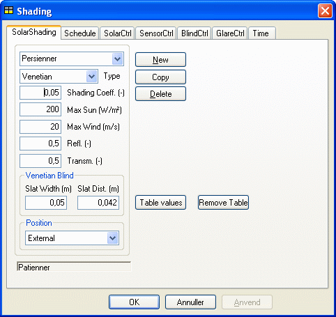

<link rel="stylesheet" href="../style.css">

# Systems, *Shading*

To any WinDoor in a BSim-model it is possible to connect a solar shading device, which is being described by input fields shown in the figure below. The solar shading device itself is described by a limited number of parameters, describing the physical properties of the device, as shown in the table below.

<figure id="center_img">

<figcaption>Dialog box for defining shading device for a WinDoor. Values for Shading Coeff. and Max Sun are only being used, if no values are given in any of the control strategies. Data for Slat Width and Slat Dist. is only being used for devices of the type Venetian blind.</figcaption>
</figure>

Data in BSim for the dialog SolarShading. Parameters in grey fields are only being used for special types of shading devices.

| Parameter       | Description                                                                                                                                         | Variations                                   | Standard value |
|-----------------|-----------------------------------------------------------------------------------------------------------------------------------------------------|----------------------------------------------|----------------|
| Type            | Shading type, where Simple is undefined.                                                                                                           | Simple; Venetian; Screen; Curtain            | Simple         |
| Shading Coeff.  | Solar shading factor, only used when simulating models created in earlier versions of BSim.                                                         | 0 - 1,0                                      | 0,5            |
| Max Sun         | Limit for solar incidence, above which the shading is being activated to maintain this value. Only used when simulating models created in earlier versions of BSim. | 0 - 800 W/m²                                 | 150 W/m²       |
| Max Wind        | Wind speed above which the solar shading is put out of activity. Only active in case of external Position for the shading device.                    | 0 - 30 m/s                                   | 0              |
| Refl.           | Reflectance of shading, e.g. reflectance of slates.                                                                                                | 0 - 1,0                                      | 0,5            |
| Transm.         | Transmittance of shading, e.g. transmittance of slates.                                                                                            | 0 - 1,0                                      | 0,1            |
| Slat Width      | Slat width, only active if the Type is Venetian.                                                                                                   | 0 - 0,5 m                                    | 0,05 m         |
| Slat Dist.      | Slat distance, only active if the Type is Venetian.                                                                                                 | 0 - 0,5 m                                    | 0,042 m        |
| Position        | Location of shading device compared to the window.                                                                                                  | External; Internal; Integrated               | Internal       |

The functionality of solar shading devices are, as any system in BSim, being described in a [schedule](11_02_Systems_schedule.md), where for one or more [time](11_17_Systems_Time.md) definitions it is possible to define which control to use when. An unlimited number of time schedules can be defined with corresponding control strategies for the solar shading device.

There can be selected among the following four control strategies:
*   [SolarCtrl](../24Miscellaneous/24_04_Shading_Control.md), controlling the solar incidence after a set-point temperature in the thermal zone,
*   [SensorCtrl](../24Miscellaneous/24_05_External_sensor_control.md), controlling the shading device after the lighting level measured at the external face of the facade where the WinDoor is located,
*   [BlindCtrl](../24Miscellaneous/24_06_Blind_control.md), controlling shading devices of the type Venetian blind according to set-points for solar incidence and direct solar radiation,
*   [GlareCtrl](../24Miscellaneous/24_06_Blind_control.md), controlling the shading device to minimize glare from the WinDoor.

Table values offers the possibility of using detailed information about the slates in the shading system by attaching information fro an [external text file](../24Miscellaneous/24_32_Standard_tables_for_slate_based_shading_systems.md). When clicking the button, a dialog is being opened to find the file on the PC.

*Remove* table is used to remove the attachment of an external file for definition of a shading system.

See also:
*   Tab [Schedule](11_02_Systems_schedule.md)
*   Tab [Time](11_17_Systems_Time.md)
