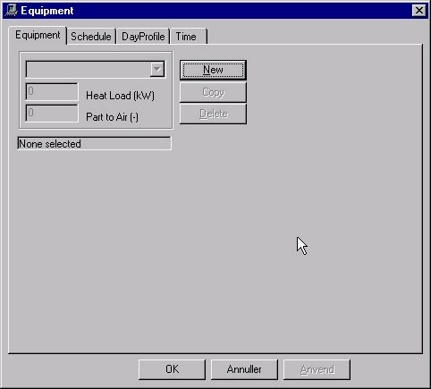

<link rel="stylesheet" href="../style.css">

# Systems, *Equipment*

The model describes heat emissions in the current thermal zone from machines, appliances, equipment, etc. Variation over the day, week and year can be defined in the schedule. Please note that heat emissions from lighting are defined separately in the [lighting dialog box](11_03_Systems_Lighting.md).

<figure id="center_img">

<figcaption>Dialog box for defining the load from equipment. If New is clicked, it is possible give the equipment a name and a load in kWh (Heat Load), as well as to specify how large a proportion of the heat given off is transferred directly (by convection) to the air in the thermal zone (Part to Air).</figcaption>
</figure>

*Heat Load* specifies the total internal heat load from machines, appliances, equipment, etc., i.e. all heat loads that cannot be specified elsewhere in the installation dialog box.

*Part to Air* specifies the proportion of heat emissions (between 0 and 1) that is supplied straight to the room air by convection. The remaining heat is distributed to the zone's faces. Part to air should rarely be set lower than 0.7. Even if a larger proportion of heat emissions is supplied to the surfaces in the form of radiation in some cases, some of the radiated heat transferred straight to thin or light materials will be released to the air within the current time step. The part to surfaces is divided between all constructions in the faces for the current zone with the same power per m² (W/m²).

[*Schedule*](11_02_Systems_schedule.md) defines connected sets of control and time definition. The control for "equipment" is of the [day profile](11_04_Systems_DayProfile.md) type, with the variation over the hours of the day being specified in percent.

Once the system has been named and the power determined, the other necessary tabs must be completed. Select the [Schedule](11_02_Systems_schedule.md) tab and select [DayProfile](11_04_Systems_DayProfile.md).

Then the periods of year in which the system can be in operation should be defined on the Time tab.

See also:

*   [Tab Schedule](11_02_Systems_schedule.md)   
*   [Tab DayProfile](11_04_Systems_DayProfile.md)   
*   [Tab Time](11_17_Systems_Time.md)

