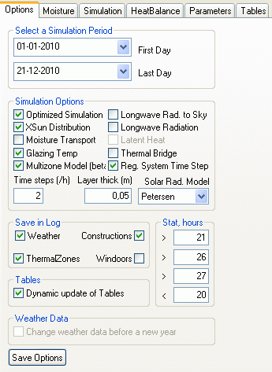

<link rel="stylesheet" href="../style.css">

# *tsbi5* - Options

The *Options* tab contains various choices for setting up the simulation to be carried out.

<figure id="center_img">

<figcaption>The Options tab of the tsbi5 simulation program manipulates the options to be set before the simulation.</figcaption>
</figure>

*   *Year*: The year to be simulated.

*   *Start*: The date on which the simulation is to start.

*   *End*: The date on which the simulation is to finish.  
It is possible to simulate more than one year with repeated use of the same climate file. This is especially useful when simulating the moisture conditions in constructions, where it can take several years to reach steady conditions. The results from simulations over several years are saved in individual result files. These result files are named after the model name, followed by "#yy", where yy is the last two digits of the year (e.g. 02 = 2002). In the results shown at the [*Tables tab*](13_09_tsbi5_Tables.md) **only** the first year of the simulation period is shown. Additional years can be opened in the result log using the *Open New Model* button at the [*Parameters* *tab*](13_08_tsbi5_Parameters.md).

*   *Simulation Options* is a group of parameters defining different simulation options:

    *   *Optimized Simulation*: Flag for using optimized simulation (control of systems in each time step vs. on hourly basis).

    *   *Moisture Transport*: Flag for simulation of moisture transport in constructions - not validated yet. This option is only active when using a database with special information about moisture transport in materials.

    *   *Long-wave Rad to Sky*: Flag for calculation of the long-wave radiation from the exterior of the building to the sky.

    *   *Long-wave Radiation*: Flag for calculating long-wave radiation exchange. When using long-wave radiation exchange, the surface resistances will be [variable, and temperature dependant](../20The_Mathematical_basis/20_11_Natural_convection_at_surfaces.md).

    *   *XSun* distribution: Flag for calculating sun distribution using [*XSun*](../14XSun_Analysis_of_incident_solar_radiation/14_01_Analysis_of_incident_solar_radiation_with_XSun.md).

    *   *Moisture Transport*: Flag for simulating the moisture transport in the constructions (requires that the moisture properties of the layers in the constructions are defined). The possibility is <u>only</u> accessible if a database containing moisture conditions for the materials is attached the model.

    *   *Latent Heat*: Flag indicating the a simulation of the latent heat-flow is to be simulated as moisture moves in the constructions.

    *   *GlazingTemp* (BSim from version 2002): Indicates that the model for detailed simulation of the glazing temperature is to be used. Requires an extended database.

    *   *Thermal Bridge*: Indicates that U-values will be corrected according to the difference between internal and external surface area of faces to enable simulation of [thermal bridges](../24Miscellaneous/24_63_Geometric_Thermal_Bridges.md).

    *   *Time steps (/h)*: Number of time steps per hour. If the number of time steps are less than required to obtain a stable simulation a warning will be shown and a recommended number of time steps is shown. Especially in connection with advanced simulation of moisture transport in the constructions, it is important to ensure that the right number of time steps are used!

    *   *Layer thick*: is the maximum thickness of sub-division of material layers, used in conjunction with moisture transport simulations.

    *   *Solar Rad. Model* is a selection dialog allowing to select different models for calculating the solar radiation on an inclined surface. This options is not active!

    *   *Reg. System Time Step*: This flag makes it possible to control all systems on time-step basis in stead of hour basis. This option is implemented to ensure backwards compatibility with results from old (prior to version 6,11,1,14) simulations.

*   *Save in Log*: Groups of parameter to be saved on an hourly basis.

    *   *Weather*: Data from the outdoor climate.

    *   *Thermal Zones*: Data from *thermal zones* (e.g. temperature, operative temperature, incident solar radiation, etc.).

    *   *Constructions*: Data from constructions (e.g. surface temperatures, condensation risk, electric yield from solar cells - via [SimPV](../16SimPV/16_01_SimPV.md) - etc.).

    *   *WinDoors*: Data from windows and doors.

*   *Tables*: Removing the check-mark from *Dynamic update of Tables* enables an *Apply* button on the *Tables* tab for manual update of the contents of the tables when jumping to a new date. This function is specially useful when analyzing parameter lists with many *Parameters*.

*   *Stat, hour*: Allows the operative temperature to be determined at which tsbi5 is to count hours above and below four temperature limits. These data can be used to assess the thermal indoor climate.

*   *Weather Data*: Using this flag, it is possible to interrupt the simulation at the turn of the year (the field is only active if simulation over the turn of the year is selected) and locate a new climate data file to be used until next turn of the year. The new climate data file is located using the standard dialog for opening a file in WIndows.   
If *Cancel* is pressed in the *Open* dialog, simulation will continue with the same climate data file as selected in the previous year.

See also:

*   [Tab Options](13_02_tsbi5_options.md)
    *   [Options + Edit](../24Miscellaneous/24_16_tsbi5_general_options.md)
    
*   [Tab Moisture](13_02_tsbi5_options.md)
*   [Tab Simulation](13_04_tsbi5_simulation.md)
*   [Tab HeatBalance](13_07_tsbi5_HeatBalance.md)
*   [Tab Parameters](13_08_tsbi5_Parameters.md)
*   [Tab Tables](13_09_tsbi5_Tables.md)

