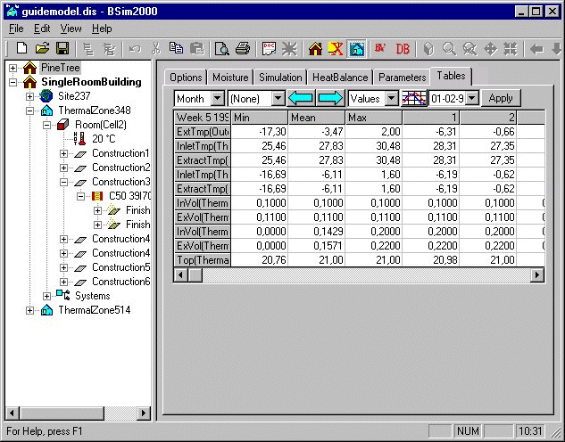
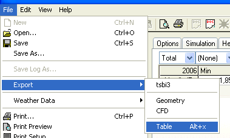

<link rel="stylesheet" href="../style.css">

# *tsbi5* - Tables

The selected parameters (*Parameters*) are used as hourly values for the tables and graphs displayed by clicking the *Tables* tab.

<figure id="center_img">

<figcaption>Hourly values displayed in table form.</figcaption>
</figure>

The table of the hourly values has a number of drop-down list boxes and buttons at the top. Their functions are as follows (from left to right):

*   Select table resolution (day, week, month or period).

*   Select period to be displayed, e.g. office hours. Using this with the choice of representation method, it is possible to analyze how many hours any given parameter is above or below any limit. Data in the tables are divided into 100 intervals, and it is thus not always possible to find the exact limit which are desired. In this case it may be necessary to interpolate between two values in the table.

*   Go to previous period (the period can be seen in the top left-hand cell).

*   Go to next period.

*   Choose between hourly values, percent under, hours under, percent above, or hours above as representation for method for the results.

*   [Switch to graph of the results.](../24Miscellaneous/24_49_tsbi5_graph.md)

*   Choose time from calendar function (date, week or month) for table or graphics (dependent on the resolution selected).

*   Manually update (*Apply*) the contents of the values in the tables. Only active if the check-mark *Dynamic update of Tables* has been removed on the [*Options* tab](13_02_tsbi5_options.md).

Export of hourly values from the selected period (resolution) to a *.txt file for treatment in other programs, e.g. spread sheet programs, can be made from the tables tab. Click *File* + *Export* + *Tables*, or Alt+x, from the *Tables* tab of tsbi5 to export hourly values of the currently selected parameters over the actual period to a *.txt file. The action opens a dialog for selecting a location for the *.txt file with the hourly data.

<figure id="center_img">

<figcaption>Export of hourly values of the selected parameters to a *.txt file over the given length of period, here "Total".</figcaption>
</figure>

See also:

*   [Tab Options](13_02_tsbi5_options.md)
*   [Tab Moisture](../24Miscellaneous/24_60_tsbi5_moisture.md)
*   [Tab Simulation](13_04_tsbi5_simulation.md)
*   [Tab HeatBalance](13_07_tsbi5_HeatBalance.md)
*   [Tab Parameters](13_08_tsbi5_Parameters.md)
*   [Tab Tables](13_09_tsbi5_Tables.md)

