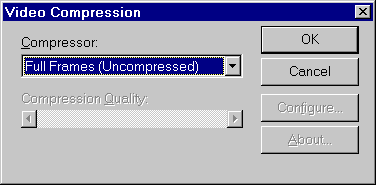

<link rel="stylesheet" href="../style.css">

# XSun video
It is possible to save video sequences from a XSun animation in files of the type ".avi", which can be shown using i.e. *Microsoft Media Player* or *Real Player*

<figure id="center_img">

<figcaption>Dialog for naming video files for XSun animations.</figcaption>
</figure>

Afterwards a dialog for for selection of compression method of the video file is shown.

<figure id="center_img">

<figcaption>Dialog for selection of compression of the video-file.</figcaption>
</figure>

A number of different compression formats are available in the selection drop-down box.

**Note:** In some version of Windows 98, Windows 2000 and Windows ME this selection box is not active by using the mouse, and only "not compressed" is available. It is though possible to select a compression format, by activating the selection box (click with the mouse) and use the arrow keys to manoeuvre among the different possibilities.

When the compression format have been selected, it is possible to changes the quality of the compression by moving the vertical scroll-bar at the bottom of the dialog.

When the file name and compression method is given, the recording can be initiated from the XSun-menu. The recording is started from the XSun-menu using the *Capture Screen Shot* or *Capture Animation* functions.

<figure id="center_img">

<figcaption>The XSun menu entry to start recording a video-sequence.</figcaption>
</figure>

If a recording already has been made, you will jump directly from to *Capture Animation* to recording further video sequences at the end of the previous recording.

**Note:** *Recording and replaying video sequences happens in the same size of window as BSim had during the recording, so normally you should not use full screen windows for recording*.
