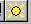

<link rel="stylesheet" href="../style.css">

# Daylight calculations with SimLight

<em>Troels Ravn</em>

Daylight calculations are activated by clicking the sun icon or the *Daylight* menu option in the *View* menu.

It is  **only**  possible to carry out a daylight calculation with SimLight in spaces where **all** windows (*WinDoor*) are described by exactly four corner points in convex spaces.

It is possible to calculate the daylight conditions at a point or on a plane, which can extend over an entire space.

<b> NB: </b> <em> SimLight assumes that any calculated space is isolated from its surroundings. This means that spaces that share a WinDoor with the space in question will have a strong impact on the results of the daylight calculations in the current space. It is recommended to remove any WinDoors between spaces before carrying out a calculation with SimLight. </em>

1. It is <u>only</u> possible to calculate the daylight conditions using SimLight if the rooms are convex.

2.  The influence from neighboring rooms is <u>not</u> taken into account by SimLight. This means that daylight to neighboring rooms will be calculated as if the windows were facing the ambient.

3.  It is <u>only</u> possible to use SimLight in rooms with <u>rectangular</u> windows.

 

*   [Daylight calculation at a point](15_02_Daylight_calculation_at_a_point.md)
*   [Daylight calculation on a plane ](15_03_Daylight_calculation_on_a_plane.md)

