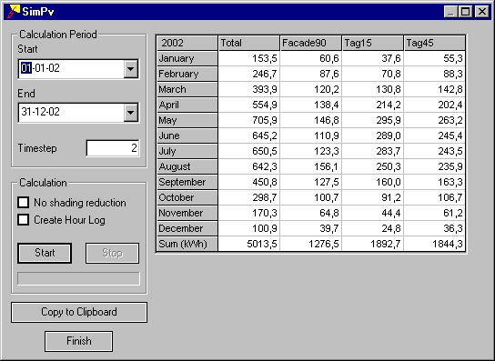

<link rel="stylesheet" href="../style.css">

# SimPV
SimPV is a tool for making a simple calculation of the electrical yield from a building-integrated solar cell (PV) system.

SimPv has been implemented as a module in BSim as an integrated part of XSun.

Areas with solar cells are [added to the model](16_02_Adding_solar_cells_to_the_model.md) in the same way as WinDoors.

<figure id="center_img">

<figcaption>Calculation of the power output from a building integrated pv-system is summarised over the months of the calculation period for each construction with PV.</figcaption>
</figure>

**Calculation Period**

*   *Start* gives the first day of the calculation period.

*   *End* gives the last day of the calculation period.

*   *Time-step* gives the number of time steps in each hour of the calculation period. Climate data are given as constant values hour by hour. It is thus only the shaded part of the PV panels that changes from time step to time step within the same hour.

**Calculation**

*   *Start* initiates the calculation of yield from solar cells in the model.

*   *Stop* terminates the calculation before the *End*-date.

*   *No shading reduction* offers the possibility of calculating the yield from the PV panels as if no shadows strike the cells. The difference between the yield with and without shadows expresses the *performance ratio*.

*   *Create Hour Log* offers the possibility to save the results from *SimPV* in a results file (*modelname#pv*) that can be merged into the ordinary results handling routines for *tsbi5* using the *Open New Model* function from the [*Parameters*](../13tsbi5_thermal_simulation/13_08_tsbi5_Parameters.md) tab.

*   At the bottom of the field the process of the calculation is shown.

**Note:** If no PV material has been assigned to the PV areas of the model, data for standard polycrystalline silicon is used in the calculations (system efficiency 10% and no proportional reduction of yield because of partial shading).

*Copy to Clipboard* saves the contents of the table to the clipboard. The copy can be used in other programs, e.g. spreadsheet programs, using the *Insert* function for further handling.

*Finish* closes the dialog.

The table shows in the first column the monthly yield from all constructions with PV in the model. The following columns show the yield from the individual constructions with PV. At the bottom the sum over the calculation period is shown for each column.