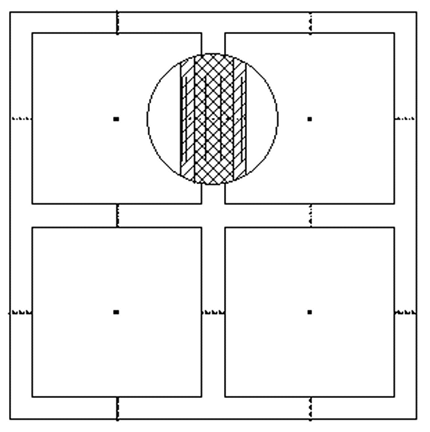

<link rel="stylesheet" href="../style.css">

# Building description and definition of nodes in constructions

A building consists of an arbitrary number of zones, which are bounded by an arbitrary number of surfaces. Furthermore, the model normally has at least one so-called virtual zone, e.g. outside air, whose condition is not calculated but is given by a user-defined file or timetable.

The zone air is represented in the building description by a nodal point where air temperature and water vapor content are calculated. It is assumed that the air in a zone is fully mixed, so it is not possible to analyze, for example, temperature stratification in an individual zone. The balance equations that give the condition of the zone air nodal point are described in a subsequent section.

 <figure id="center_img">

<figcaption>Building with four zones showing nodal points and control volumes for zone air (one nodal point), constructions (several nodal points).</figcaption>
</figure>

The constructions consist of one or more homogeneous layers, each made of a single material characterized by thermal properties. To achieve a sufficiently accurate calculation, thick material layers are divided into several thinner layers (control volumes). This is done by the program automatically selecting a nodal point distance not exceeding 0.05 m (5 cm). The user can, however, change the nodal point distance by typing a maximum distance in the layer menu under construction types. For each construction layer, BSim places the nodal points at equal distance so that each nodal point represents the same thermal mass. Special conditions apply to the outer layer on each side of the construction: a nodal point is always defined at each surface of the construction, and each surface control volume has half the thickness that is normally calculated for the other layers. A construction will thus always have at least 3 nodal points.
