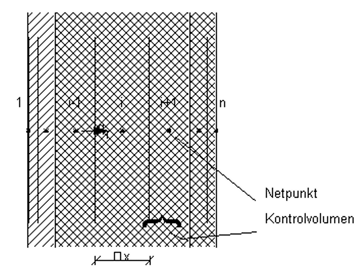

<link rel="stylesheet" href="../style.css">

# Heat transmission in constructions

Heat transmission within constructions is described non-stationarily, i.e. allowing for each individual layer's thermal capacity. An example of the nodal point breakdown for a construction is shown in the previous figure. The construction consists of several layers, which are broken down here into several control volumes. The control volumes are indicated by the letter i.

For each control volume, the heat transferred to and from neighboring volumes is calculated in each time-step. The sum of these contributions changes the enthalpy content from one time-step to the next, which can be converted to a temperature change using the material's specific heat.

<figure id="center_img">

<figcaption>The breakdown into control volumes and placing of nodal points for a wall consisting of several layers of different materials.</figcaption>
</figure>

Consider control volume i in the figure. The heat transmission from the neighboring element i-1 can be calculated from Fourier's heat transmission equation with the approximation that the temperature sequence between the nodal points of these two control volumes is the same as in a stationary situation. This approximation, the finite-difference approximation, replaces the differential temperature gradients in Fourier's law with gradients calculated from finite temperature differences between nodes. This is a common technique underlying most numerical methods and is reasonably accurate as long as the discretization (the node distance) is not too coarse. To make the description general, it is assumed that the two materials each have their own thermal conductivity and that the control volumes each have their own thickness. One thus obtains the heat transmission per unit of time and area (the heat flux) in the dividing surface between the two control volumes, valid for the time-step from j to j+1:

$$ q_i^{j+1} = - \frac{T_i^{j+1} - T_{i-1}^{j+1}}{\frac{\Delta x_{i-1}}{2 \lambda_{i-1}} + \frac{\Delta x_i}{2 \lambda_i} + R_i} \tag{1} $$

*q* is the heat flux, W/m²

*Δx* is the width of the control volume, m

*λ* is the thermal transmittance of the material, W/m K

*R* is the resistance between the control volumes, m²K/W

*i* is the index for the place

*j* is the index for the time

The heat flux is taken positive in the x-direction, which corresponds to the positive numbering of the control volumes. The sum of thermal resistances between nodes i-1 and i is expressed in the denominator. The thermal resistance between the control volumes is zero unless a non-zero resistance has been specified in the construction layer definition menu at the division between two layers (for example, an air gap).

Based on <a href="#eq1">Equation 1</a>, the heat flux is calculated from the temperatures at the end of the time-step. When the calculation has reached time-step j and conditions are to be calculated up to time j+1, the state at the conclusion of the time-step is not yet known, and explicit values for the temperatures cannot therefore be inserted on the right-hand side of <a href="#eq1">Equation 1</a>. An implicit calculation procedure is therefore used, as described below.

Throughout the time-step, the implicitly indicated heat flux from <a href="#eq2">Equation 2</a> is assumed to be constant, and the increase in enthalpy for the control volume i is summed up as follows:

$$ \rho_i \Delta x_i  \frac{h_i^{j+1} - h_i^j}{\Delta t} = - \left( q_{i+1}^{j+1} - q_{i}^{j+1} \right) \tag{2} $$

*h* is the specific enthalpy (defined on the basis of a reference level), J/kg

*Δt* is the size of the time-step, s

By expressing the specific enthalpy alterations as a temperature alteration multiplied by the specific heat capacity, and by inserting the expressions for q from <a href="#eq1">Equation 1</a> the following expression can be set up:

$$
\begin{aligned}(\rho c_p)_i \Delta x_i\frac{T_i^{j+1} - T_i^j}{\Delta t}&=\frac{T_{i-1}^{j+1} - T_i^{j+1}}{\dfrac{\Delta x_{i-1}}{2 \lambda_{i-1}}+ \dfrac{\Delta x_i}{2 \lambda_i}+ R_i} \\&\quad+ \frac{T_{i+1}^{j+1} - T_i^{j+1}}{\dfrac{\Delta x_i}{2 \lambda_i}+ \dfrac{\Delta x_{i+1}}{2 \lambda_{i+1}}+ R_{i+1}}\end{aligned} \qquad (3)$$

This equation is set up for all i and is solved simultaneously for all, as the equations mutually use "each other's" information regarding the temperature on the new time level. This is only possible if the boundary conditions are known. <a href="#eq3">Equation 3</a> is therefore expressed in a slightly different form, which is valid for the boundary volume, i= 1, at face 1 of the construction. As the boundary node lies close to the actual boundary, the following <a href="#eq4">Equation 4</a> is achieved:

$$
\begin{aligned}(\rho c_p)_1 \Delta x_1\frac{T_1^{j+1} - T_1^j}{\Delta t}=q_{\text{surf,side1}}+ \frac{T_{\text{air}} - T_1^{j+1}}{R_{\text{surf side 1}}} \\&\quad+ \frac{T_2^{j+1} - T_1^{j+1}}{\dfrac{\Delta x_1}{\lambda_1}+ \dfrac{\Delta x_2}{2 \lambda_2}+ R_2}\end{aligned}\qquad (4)$$

*qsurf,face1 * is heat transfer directly to the surface , W/m²

*Rsurf,face1 * is the surface resistance, m² K/W

T1 is the same quantity that in the section entitled **The zone's total heat balance** was called Tsurf. The heat transfer directly to the surface for internal zones is composed of part of the zone's solar incidence, which is not assumed to be "lost" or transferred to the zone's air, and of any heat share from systems that goes to the surfaces. The sun's surface contribution is distributed according to each surface's area, with different weighting for floors, walls, and ceilings as indicated in the solar distribution menu for the zone, while the surface contribution from systems is shared equally over the zone's surface areas. Surfaces facing the outside air have a heat contribution calculated from the solar incidence on an external surface with the relevant slope and orientation multiplied by the absorption factor for the surface material. For constructions, no effect is calculated for shadowing objects in the building's vicinity or for building projections. Likewise, no account is taken of long-wave radiation to the surroundings, especially the sky.

<a href="#eq4">Equation 4</a> gives no indication of what time level is valid for the neighboring zone's air temperature Tair. This question is dealt with at the end of this section.

An equation corresponding to (4) is valid for face 2 (i=n).

For use in setting up the equation system for all i, the help-sizes H and HO are introduced for the inner control volumes:

$$ H_i = \frac{1}{\frac{\Delta x_{i-1}}{2 \lambda_{i-1}} + \frac{\Delta x_i}{2 \lambda_i} + R_i} \tag{5} $$

$$ HO_i = \frac{(\rho c_p)_i \Delta x_i}{\Delta t} \tag{6} $$

For the surface control volume at face 1, HO is defined as above, while H1 and H2 are determined by:

$$ H_1 = \frac{1}{R_{surf, face1}} \tag{7} $$

$$ H_2 = \frac{1}{\frac{\Delta x_{1}}{\lambda_{1}} + \frac{\Delta x_2}{2 \lambda_2} + R_2} \tag{8} $$

 

Expressions corresponding to these are valid for the H-functions (Hn and Hn1) close to the surface at face 2. By means of these help-values, <a href="#eq3">Equation 3</a> and <a href="#eq4">Equation 4</a> can be rewritten in a simpler form, as links which involve the temperatures on a "new" time level, j+1, are written on the left hand side of the equals sign, and values given explicitly, such as links which involve the temperature on the "old" time level, j, are written on the right hand side.

For the inner control volumes, the following is obtained:

$$ - H_i T_{i-1}^{j+1} + \left(HO_i + H_i + H_{i+1}\right) T_{i}^{j+1} - H_{i+1} T_{i+1}^{j+1} = HO_i T_{i}^{j} \tag{9} $$

This expression can be further simplified by introducing the coefficients A, B, C and D, the definition of which is immediately apparent by comparison between <a href="#eq8">Equation 8</a> and <a href="#eq9">Equation 9</a>:

$$ A_i  T_{i-1}^{j+1} + B_i T_{i}^{j+1} + C_i T_{i+1}^{j+1} = D_i \tag{10} $$

For surface control volumes at face 1, the following is obtained:

$$ \left( HO_1 + H_1 + H_2 \right)T_1^{j+1} - H_2T_2^{j+1} = HO_1T_1^j \\ + H_1T_{\text{air}} + q_{\text{surf, side 1}} \tag{11} $$

This expression can also be simplified by introducing the coefficients B, C and D:

$$ B_1 T_{1}^{j+1} + C_1 T_{2}^{j+1} = D_1 \tag{12} $$

The expressions from <a href="#eq11">Equation 11</a>, <a href="#eq12">Equation 12</a> and the corresponding expression which could be written for the surface at face 2, can be gathered into one equation system:

$$ \left[\begin{array}{cccccc}B_1 & C_1 & & & & \\ \cdot & \cdot & \cdot & & & \\ & A_i & B_i & C_i & & \\ & & \cdot & \cdot & \cdot & \\ & & & A_n & B_n & \end{array} \right] \left[ \begin{array}{c} T_1^{j+1} \\ \cdot \\ T_i^{j+1} \\ \cdot \\ T_n^{j+1} \end{array} \right] = \left[ \begin{array}{c} D_1 \\ \cdot \\ D_i \\ \cdot \\ D_n \end{array} \right] \tag{13} $$

 

The coefficient matrix in this equation system has zeros outside all three main diagonals and can therefore be solved by a simple, efficient algorithm, the so-called double sweep or tri-diagonal method. This method is described in several textbooks from the Numerical Institute [[Solution of numerical, linear equations, 1972](20_28_Literature.md)], amongst others.

When proceeding from one time-step to another, the newly calculated temperatures become the "old" temperatures for the next time-step. In this manner, it is possible to go on calculating further in time, as long as one just has knowledge for each time-step regarding the boundary conditions, i.e. air temperatures and heat inductions by radiation at each of the two surfaces. In order to start calculation in the very first time-step, a fixed start temperature is selected (the standard is that all temperatures are set to 20 °C), and beginning with these values, the first day in the simulation period is calculated a number of times, until stability is achieved, i.e. a more or less stable 24 hour rhythm (quasi-stationary condition) has been established.

#### **The time-step's size**

In order to achieve reasonable accuracy in the calculation, for example the previously mentioned assumption regarding quasi-stationary conditions between the nodal points, it is necessary to limit the time-step size, even though the implied limitation method itself does not give rise to instabilities when the time-steps are too large. This is, for example, the case for the explicit method, which uses temperatures on the "old" level in Equation 1. An upper time-step limit is set by the fact that weather data are read at one-hour intervals and that each hour is calculated with at least two time-steps. Furthermore, it has been decided to limit the size of the so-called Fourier numbers for the control volumes. The Fourier number for a control volume can be calculated as follows:

$$ R = \frac{\lambda}{\rho c_p} \frac{\Delta t}{(\Delta x)^2} \tag{14} $$

In BSim, the standard value for the time step Δt is selected so that the Fourier number does not exceed 1.25 for any of the control volumes in the building model. The following maximum time-step is thus obtained:

$$ (\Delta t)_{max} = \min\limits_{\text{all control volumes}} \left(1.25 \frac{\rho c_p}{\lambda} (\Delta x)^2\right) \tag{15} $$

For comparison, the critical Fourier-number is 0.5 for the explicit calculation method. The time-step demand is thus seen to be most critical for equations containing thin layers of materials with a combination of high thermal conductivity and low density and specific heat. The quadratic dependence of the layer thickness should be especially noted, since all things being equal, this means that four times as many time-steps must be used, each time the determinative control volume's thickness is halved.

When starting a simulation, the program prints out the calculated time-step (the recommended number of time-steps per hour), and the user should be aware that a significant difference between the recommended and selected number can cause greater inaccuracy in the calculations.

#### **Coupling heat transport in the constructions to the zones' heat balance**

The calculation of heat streams in the constructions presupposes knowledge regarding the temperatures in all adjoining zones, and the calculation of the air temperatures in the zones assumes, amongst other things, knowledge of the surface temperatures in all constructions. This mutual dependence could tempt one to build up a large equation system, in which all the zone's air temperatures and temperature distributions in all constructions would be solved in one go. This is theoretically possible, but not especially expedient, since the equation system's coefficient matrix is not in general tri-diagonal as in <a href="#eq13">Equation 13</a>. The methods used to solve a complex equation system are regarded as too calculation-heavy for this purpose. Sufficient accuracy can be achieved with the following procedure:

1.  First, the air temperature of each zone is calculated on the basis of the actual time-step heat contribution and the previous time-step transmission loss through the construction surfaces.

2.  On the basis of the calculated air temperatures, non-stationary calculations are carried out of the construction's temperature conditions.

3.  Calculation of the air temperature from (1) is repeated with the transmission heat losses which are given by the new temperature distributions in the constructions.

By this means, the zones' heat balances are calculated twice for each time-step. This part of the calculations is not large in comparison with the calculation of the non-stationary conditions in the constructions.

The procedure described is followed when choosing "optimized" on the Options tab of the tsbi5 interface. The repeat calculation of the zones' air temperature under (3) is excluded when a simple calculation is chosen instead.
