<link rel="stylesheet" href="../style.css">

# Floor heating - Mathematical basis

<strong>RADIANT HEATING/COOLING MODULE FOR BSim</strong>    
<strong>Theoretical reference</strong>  
<strong>By Massimiliano Scarpa</strong>

## **Context**  
1. <a href="#main-concepts">MAIN CONCEPTS</a>   
2. <a href="#2d-simplification">2D SIMPLIFICATION</a>   
2.1. <a href="#status-of-the-art">Status of the art before the current research</a>  
2.2. <a href="#contribution-current-research">The contribution of the current research</a>  
2.2.1. <a href="#method">Method</a>
3. <a href="#epsilon-ntu-method">THE ε-NTU METHOD FOR THE DESCRIPTION OF THE VARIATION OF THE WATER TEMPERATURE ALONG THE CIRCUIT</a>   
3.1. <a href="#grounds-epsilon-ntu">Grounds of the ε-NTU method</a>  
3.2. <a href="#epsilon-ntu-developed-model">The ε-NTU method in the developed model</a>  
3.3 <a href="#thermal-resistances">The calculation of thermal resistances Rw, Rp and Rx</a>  
3.3.1 <a href="#thermal-resistance-rw">The calculation of thermal resistance Rw</a>  
3.3.2 <a href="#thermal-resistance-rp">The calculation of thermal resistance Rp</a>  
3.3.3 <a href="#thermal-resistance-rx">The calculation of thermal resistance Rx</a>   
3.4. <a href="#calculation-u">The calculation U</a>

4. <a href="#global-view">GLOBAL VIEW OF THE WHOLE MODULE</a>   
5. <a href="#bibliography">BIBLIOGRAPHY</a>   
6. <a href="#appendix-a">APPENDIX A</a>

 

<h2 id="main-concepts"><strong>1. MAIN CONCEPTS</strong></h2>

Hydronic radiant systems embedded in building structures imply 2D thermal fields, due to the presence of the pipes. As a consequence, the description of radiant heating/cooling systems should involve the calculation of 2D heat flows, so that long calculation times would be required. Moreover, the thermal field varies along the flow direction, since the water decreases/increases its own temperature and consequently the heat transfer to the rest of the slab decreases.

To sum up, in order to decrease the calculation time and maintain good accuracy, appropriate simplifications must be conceived.

The most important simplifications in the current module are summarized below:

1. 2D simplification. The effects of the 2D thermal field due to the presence of the pipes are represented by a thermal resistance coupling the pipe external surface with the pipe level in the slab. This allows a shift from a 2D calculation domain to a 1D one.

2. The ε-NTU method for the description of the water temperature variation along the circuit. The water temperature change along the pipes is described using ε-NTU theory, which is widely used in heat exchanger performance calculations.

 

<h2 id="2d-simplification"><strong>2. 2D SIMPLIFICATION</strong></h2>

<h3 id="status-of-the-art"><strong>2.1. Status of the art before the current research</strong></h3>

The main concept for reducing the 2D thermal field to a 1D model is explained here.

Starting from previous studies by Glück[1, 2], Dorer, Koschenz, and Lehmann [3, 4, 5] developed a simple model for describing the thermal behavior of thermally activated building systems in steady-state conditions. This model is frequently called the "Resistance Method" and describes the relation between supply water temperature and the average temperature at pipe level using a series of thermal resistances. The involved resistances represent the following phenomena:

*   Decrease/increase in water temperature due to flow along the circuit (thermal resistance Rz). This resistance connects the supply water temperature with the logarithmic mean water temperature along the pipe circuit, which may then be used as a reference for estimating heat exchange between the water and the pipe's inner surface.

*   Temperature gradient from the logarithmic mean temperature of the water to the mean temperature of the inner surface of the pipe. It is basically due to the convection heat transfer (thermal resistance Rw).

*   Temperature gradient from the mean temperature of the inner surface of the pipe to the mean temperature of the outer surface of the pipe (thermal resistance Rp). It is due to conduction heat transfer through the pipe wall.

*   Temperature gradient from the mean temperature of the outer surface of the pipe to the mean temperature at the pipe level (thermal resistance Rx).

The significance of such a simplification is summarized by means of the following figure.

<figure id="center_img">
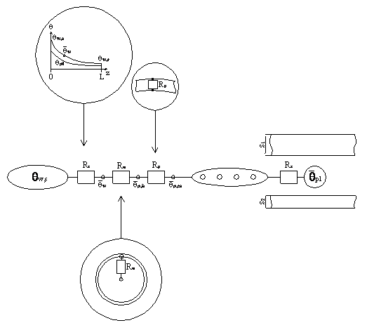
<figcaption>Figure 1 - Background concept of the "Resistance Method".</figcaption>
</figure>

Rx is the most interesting part of the model. In fact, it is shown that, in certain conditions, the relation between the pipe and the pipe level can be described via a formula derived from the analytical solution of the 2D thermal domain shown in Figure 2:

<figure id="center_img">
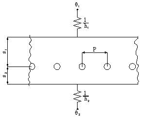
<figcaption>Figure 2 - Reference model and generic temperature profile along the pipes level.</figcaption>
</figure>

The analytical solution was obtained by Glück and is expressed by the formula:

<figure id="center_img">

<figcaption></figcaption>
</figure>

where
 

$$ U_1 = \left( \frac{1}{h_1} + \frac{s_1}{\lambda_s} \right)^{-1} $$

 

$$ U_2 = \left( \frac{1}{h_2} + \frac{s_2}{\lambda_s} \right)^{-1} $$

 and

$$ g_1(n) = \frac{\frac{\frac{h_1}{\lambda_s} \cdot P + 2 \cdot \pi \cdot n}{\frac{h_1}{\lambda_s} \cdot P - 2 \cdot \pi \cdot n}\cdot e^{\frac{-4\cdot \pi \cdot n}{P} \cdot s_2} - e^{ \frac{-4\cdot \pi \cdot n}{P} \cdot (s_1+ s_2)}}{e^{ \frac{-4\cdot \pi \cdot n}{P} \cdot (s_1+ s_2)} - \frac{\frac{h_1}{\lambda_s} \cdot P + 2 \cdot \pi \cdot n}{\frac{h_1}{\lambda_s} \cdot P - 2 \cdot \pi \cdot n}\cdot\frac{\frac{h_2}{\lambda_s} \cdot P + 2 \cdot \pi \cdot n}{\frac{h_2}{\lambda_s} \cdot P - 2 \cdot \pi \cdot n}} $$

 

$$ g_2(n) = \frac{\frac{\frac{h_2}{\lambda_s} \cdot P + 2 \cdot \pi \cdot n}{\frac{h_2}{\lambda_s} \cdot P - 2 \cdot \pi \cdot n}\cdot e^{\frac{-4\cdot \pi \cdot n}{P} \cdot s_1} - e^{ \frac{-4\cdot \pi \cdot n}{P} \cdot (s_1 + s_2)}}{e^{ \frac{-4\cdot \pi \cdot n}{P} \cdot (s_1+ s_2)} - \frac{\frac{h_1}{\lambda_s} \cdot P + 2 \cdot \pi \cdot n}{\frac{h_1}{\lambda_s} \cdot P - 2 \cdot \pi \cdot n}\cdot\frac{\frac{h_2}{\lambda_s} \cdot P + 2 \cdot \pi \cdot n}{\frac{h_2}{\lambda_s} \cdot P - 2 \cdot \pi \cdot n}} $$

 

Dorer, Koschenz, and Lehmann demonstrated that for conductive materials such as concrete, under the conditions:

$$ \begin{cases}  
\frac{s_1}{P} > 0.3 \\  
\frac{s_2}{P} > 0.3 \\  
\frac{d_p}{P} < 0.2  
\end{cases}  $$

Glück's formula can be simplified with little effect on accuracy, yielding:

$$ R_x = \frac{P \cdot \ln \left( \frac{P}{\pi \cdot d_p} \right)}{2 \cdot \pi \cdot \lambda_s} $$

This method was derived assuming steady-state thermal conditions. Subsequent research by De Carli, Koschenz, Olesen, and Scarpa[6] assessed the accuracy of the model for unsteady thermal behavior in thermally activated building systems. The research showed that the model can be extended to unsteady conditions with negligible loss of accuracy. The material region around the pipes has a low time constant, so unsteady behavior decays quickly and the steady-state solution is a good approximation, especially over the full simulation period.

<h3 id="contribution-current-research"><strong>2.2. The contribution of the current research</strong></h3>

<h4 id="method"><strong>2.2.1. Method</strong></h4>  
Further development of the "Resistance Method" was still bound by the limitations of Glück's analytical solution (for example, homogeneous material around the pipe) and the assumptions used to simplify Glück's solution into

$$ R_x = \frac{P \cdot \ln \left( \frac{P}{\pi \cdot d_p} \right)}{2 \cdot \pi \cdot \lambda_s} $$

Such limitations were defined in order to obtain an easy-to-use formula, but, based on these limitations, the model can be used only for the description of thermally activated building systems, with pipes deeply embedded in a thick concrete layer. Even limitations in pipe spacing and water mass flow rate are present. But the aim of the current research is to describe the thermal behavior of any kind of radiant heating/cooling system. However, the main concept was really appreciable, so the first part of the current research was dedicated to test the possibility to extend such a model to more complex conditions.

For that purpose, the thermal behaviors of various kinds of slabs were examined via a 2D calculation tool and via a 1D model connected to the water temperature via a proper thermal resistance, under unsteady state conditions.

The radiant systems called "Type A", "Type E", "Type X1" and "Type G" were considered:

<figure id="center_img">
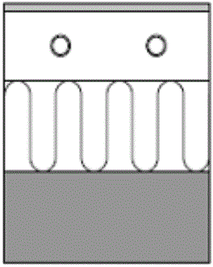
<figcaption>Type A</figcaption>
</figure>
 
<figure id="center_img">
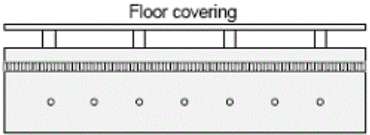
<figcaption>Type E</figcaption>
</figure>
 
<figure id="center_img">
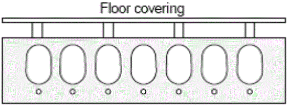
<figcaption>Type X1</figcaption>
</figure>
 
<figure id="center_img">
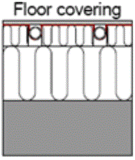
<figcaption>Type G</figcaption>
</figure>

The simulations studied the thermal behavior of the entire deck, from the floor and ceiling surfaces to the pipe external surface, while neglecting the remainder of the pipe. The remainder of the pipe is modeled as a thermal resistance because its thermal inertia is assumed negligible.
As a general rule, all air cavities were treated as non-conductive regions, so their edges were considered adiabatic.
The following figures show the analyzed geometries, each examined with fine and coarse meshes.

<h4> 1. Type A </h4>
<figure id="center_img">
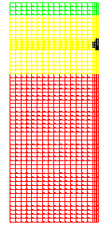
<figcaption>1.1 Real geometry and fine mesh</figcaption>
</figure>
 
Material 1: s=0.02, λ=0.170, ρ=600, cp=2500 Material 2: s=0.10, λ=1.600, ρ=2300, cp=900 Material 3: s=0.25, λ=0.039, ρ=50, cp=850 Pipe: de=0.02 m Pipe spacing: P = 0.3 m 
<figure id="center_img">
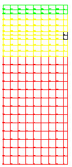
<figcaption>1.2 Simplified geometry and rough mesh</figcaption>
</figure>

<h4> 2. Type E </h4>
<figure id="center_img">
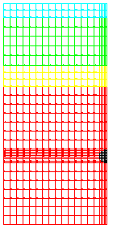
<figcaption>2.1 Real geometry and fine mesh</figcaption>
</figure>
 
Material 1: s=0.02, λ=0.170, ρ=600, cp=2500 Material 2: s=0.07, λ=1.200, ρ=2000, cp=900 Material 3: s=0.03, λ=0.040, ρ=100, cp=850 Material 4: s=0.20, λ=1.600, ρ=2300, cp=900 Pipe: de=0.02 m Pipe spacing: P = 0.3 m

<figure id="center_img">
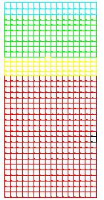
<figcaption>2.2 Simplified geometry and rough mesh</figcaption>
</figure>
<h4> 3. Type X1 </h4>
<figure id="center_img">
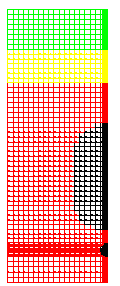
<figcaption>3.1 Real geometry and fine mesh</figcaption>
</figure>
 
Material 1: s=0.06, λ=0.200, ρ=300, cp=2500 Material 2: s=0.05, λ=0.040, ρ=100, cp=850 Material 3: s=0.30, λ=1.600, ρ=2300, cp=900 Pipe: de=0.02 m Pipe spacing: P = 0.3 m
<figure id="center_img">
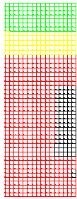
<figcaption>3.2 Simplified geometry and rough mesh</figcaption>
</figure>

<h4> 4. Type G </h4>
<figure id="center_img">
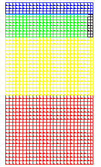
<figcaption>4.1 Real geometry and fine mesh</figcaption>
</figure>
 
Material 1: s=0.02, λ=0.170, ρ=600, cp=2500 Material 2: s=0.04, λ=0.200, ρ=300, cp=2500 Material 3: s=0.10, λ=0.039, ρ=50, cp=850 Material 4: s=0.12, λ=1.600, ρ=2300, cp=900 Plate: s=0.0005, λ=200, ρ=2700, cp=900 Pipe: de=0.02 m Pipe spacing: P = 0.3 m

<figure id="center_img">
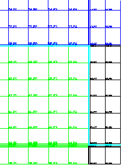
<figcaption>4.2 Simplified geometry and rough mesh</figcaption>
</figure>

The 2D calculations and the 1D model have been contrasted by comparing the corresponding thermal behaviors along a period with imposed temperatures at the surfaces of the floor, ceiling and pipe. In Figure 5, an example of temperature profiles used in the comparison is shown:

<figure id="center_img">
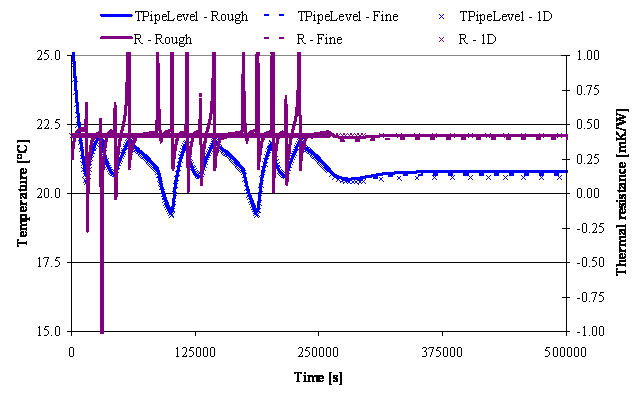
<figcaption>Figure 5 - Boundary conditions.</figcaption>
</figure>

The first part of the simulation period shows the difference in dynamic thermal behavior. The comparison is performed in terms of heat flows (through the floor, ceiling, and pipe surfaces), temperatures (mean temperature at pipe level, i.e. averaged over the pipe spacing), and perceived thermal resistance (between the external pipe surface temperature and the mean temperature at pipe level).

At the end of each simulation, constant boundary conditions were imposed to reach steady-state behavior.

In order to summarize the 2D thermal domain by means of a 1D model, the thermal resistance derived from the 2D simulation (acquired under steady state conditions) was used as a constant thermal resistance in the 1D model, placed at the pipe level and acting during the all simulation period. Thus, the same boundary conditions as in 2D simulations are imposed and the heat flows and temperatures of the 1D model are compared with the 2D ones. If they approach each other, then the 2D model can be substituted by a 1D model where the thermal resistance acting between the pipe level and the external surface of the pipe is derived from a 2D model running under steady state conditions.

After materials, geometries and boundary conditions were inputted, the 2D program starts the simulation. The focus in the analysis of results was on the mean temperature at the pipe level, the perceived thermal resistance between the external surface of the pipe and the pipe level, and the heat flows passing through the floor, the ceiling and the pipe. These results were used in the comparisons and in the calculation of the thermal resistance to be applied in the 1D model as well. In fact, the thermal resistance perceived by the deck between the external surface of the pipe and the pipe level can be expressed by the following equation:

$$ R_{1D} = \frac{\theta_{PipeLevel} - \theta_{Pipe}}{P \cdot \dot Q_{Pipe}} $$

This resistance varies during the simulation period because it is derived from time-dependent variables. However, the reference value is taken from steady-state conditions, assuming it is a good approximation for the unsteady thermal behavior of the slab embedding the pipes. This hypothesis is supported by the diagrams in APPENDIX A showing the variation of thermal resistance during the simulation period; the value varies but remains close to the steady-state value.

For Type G, the pipe level is placed at the plate position, since that horizontal plane is connected to the pipe by the smallest thermal resistance.

The 1D model used for the simulations is based on finite control volumes and uses the same boundary conditions as the 2D model. The only difference is the treatment of the temperature on the pipe's external surface. In the 1D model the external pipe surface cannot be distinguished from the rest of the slab, so it is represented by a thermal resistance derived from the 2D calculations, as explained above.

Finally, heat flows and temperatures are calculated with the 1D model and compared with results from the 2D simulation code.

 

<h2 id="epsilon-ntu-method"><strong>3. THE e-NTU METHOD FOR THE DESCRIPTION OF THE VARIATION OF THE WATER TEMPERATURE ALONG THE CIRCUIT</strong></h2>

The Efficiency-NTU (Number of Transfer Units) method is used to describe heat exchange between the water supply temperature and the average temperature at the pipe level. In this respect, the module developed for BSim deviates from the "Resistance Method," which uses the thermal resistance Rz to describe water temperature variation along the circuit.

In the developed model, the ε-NTU method is applied by assuming the pipe level has a uniform temperature along the circuit. This is consistent with the BSim approach, which assumes constant temperatures over the entire surface.

<h3 id="grounds-epsilon-ntu"><strong>3.1. Grounds of the e-NTU method</strong></h3>

For the following treatment, we may refer to the following figure.

<figure id="center_img">
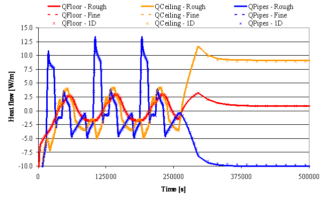
<figcaption>Figure 6 - Temperature variations in fluids in parallel and counter flow ideal heat exchangers.</figcaption>
</figure>

The ε-NTU method is mainly based on two definitions:

 

*   Efficiency

$$ \varepsilon = \frac{\text{Actual heat transfer}}{\text{Theoretical max heat transfer}} = \frac{\dot Q}{\dot Q_{max}} $$

*   Number of Transfer Units:

$$ \text{NTU} = \frac{U \cdot A}{(\dot m \cdot c_p)_{min}} $$

Where $ (\dot m \cdot c_p)_{min} $ is the minimum thermal capacity between the two flows.

In other words, it refers to the flow that is expected to sustain the maximum variation in temperature, since:

$$ \dot Q = (\dot m \cdot c_p)_{H} \cdot (\theta_{H,In} - \theta_{H,Out}) = (\dot m \cdot c_p)_{C} \cdot (\theta_{C,Out} - \theta_{C,In}) $$

where the previous subscripts have the following meanings:   
   H = Hot fluid   
   C = Cold fluid   
   In = Supply side   
   Out = Return side

From this distinction between the two fluids, we may derive:

$ R = \frac{(\dot m \cdot c_p)_{Min}}{(\dot m \cdot c_p)_{Max}} $ that may be equal to $ R = \frac{(\dot m \cdot c_p)_{H}}{(\dot m \cdot c_p)_{C}} $ or $ R = \frac{(\dot m \cdot c_p)_{C}}{(\dot m \cdot c_p)_{H}} $ , depending on the thermal capacities of the 2 flows.

The temperatures of the fluids vary along the heat exchanger, so even the temperature difference between the fluids varies along the heat exchanger. In order to have a temperature difference that makes it possible to sum up the temperature differences along the whole length of the exchanger, the logarithmic mean temperature difference is defined (LMTD):

$$ \text{LMTD} = \frac{\Delta \theta_2 - \Delta \theta_1}{\ln \left(\frac{\Delta \theta_2}{\Delta \theta_1}\right)} $$

so that

$$ \dot{Q} = (\dot{m} \cdot c_p)_{H} \cdot (\theta_{H,\text{In}} - \theta_{H,\text{Out}}) = (\dot{m} \cdot c_p)_{C} \cdot (\theta_{C,\text{Out}} - \theta_{C,\text{In}}) = U \cdot A \cdot \text{LMTD} $$

The treatment must be split into at least two cases. Depending on the type of relative fluid flow (pure counter flow, pure parallel flow, pure cross flow, or combinations), LMTD, Q, and Qmax are expressed differently. For our purposes, the treatment is limited to counter flow and parallel flow:

<h3> Fluids in pure counter flow </h3>

Definition of maximum heat flow deliverable between the fluids: 

 

$ \dot Q_{Max} = (\dot m \cdot c_p)_{Min} \cdot (\theta_{H,In} - \theta_{C,In}) $

 

As a consequence,

 

$ \varepsilon = \frac{(\dot m \cdot c_p)_{H} \cdot (\theta_{H,In} - \theta_{H,Out})}{(\dot m \cdot c_p)_{Min} \cdot (\theta_{H,In} - \theta_{C,In})} = \frac{(\dot m \cdot c_p)_{C} \cdot (\theta_{C,In} - \theta_{C,Out})}{(\dot m \cdot c_p)_{Min} \cdot (\theta_{H,In} - \theta_{C,In})} $

 

Moreover,

 

$ \text{LMTD} = \frac{(\theta_{H,Out} - \theta_{C,In}) - (\theta_{H,In} - \theta_{C,Out})}{\ln \left( \frac{(\theta_{H,Out} - \theta_{C,In})}{(\theta_{H,In} - \theta_{C,Out})} \right)}  $

 

As a consequence,

 

$ \varepsilon = \frac{1 - e^{[-NTU (1 - R)]}}{1 - R \cdot e^{[-NTU (1 - R)]}} $

<h3> Fluids in pure parallel flow </h3>

Definition of maximum heat flow deliverable between the fluids:

 

$ \dot Q_{Max} = (\dot m \cdot c_p)_{Min} \cdot (\theta_{H,In} - \theta_{C,Out}) $

 

As a consequence,

 

$ \varepsilon = \frac{(\dot m \cdot c_p)_{H} \cdot (\theta_{H,In} - \theta_{H,Out})}{(\dot m \cdot c_p)_{Min} \cdot (\theta_{H,In} - \theta_{C,In})} = \frac{(\dot m \cdot c_p)_{C} \cdot (\theta_{C,In} - \theta_{C,Out})}{(\dot m \cdot c_p)_{Min} \cdot (\theta_{H,In} - \theta_{C,In})} $

 

Moreover,

 

$ \text{LMTD} = \frac{(\theta_{H,Out} - \theta_{C,Out}) - (\theta_{H,In} - \theta_{C,In})}{\ln \left( \frac{(\theta_{H,Out} - \theta_{C,Out})}{(\theta_{H,In} - \theta_{C,In})} \right)} $

 

As a consequence,

 

$ \varepsilon = \frac{1 - e^{[-NTU (1 + R)]}}{1 + R} $

<h3 id="epsilon-ntu-developed-model"><strong>3.2. The e-NTU method in the developed model</strong></h3>

The two arguments are joined here. In the present case, by assuming the pipe level has a uniform temperature,

$$ (\dot m \cdot c_p)_{Max} \rightarrow \infty \Rightarrow R \rightarrow 0 \Rightarrow \varepsilon \equiv 1 - e^{-NTU} = 1 - e ^{- \frac{U \cdot A}{(\dot m \cdot c_p)_{Min}}} $$

Then, for radiant heating/cooling systems, the efficiency assumes the following shape:

$$ \varepsilon \equiv 1- e^{ - \frac{A_{Floor}}{(R_w + R_r + R_x) \cdot (\dot m \cdot c_p)_{Water}}} $$

This makes it possible to calculate the heat flow between the water and the pipe level of the slab easily. It is given by:

$$ \dot Q = \varepsilon \cdot (\dot m \cdot c_p)_{Water} \cdot (\theta_{Water, in} - \theta_{PipeLevel}) $$

 

<h3 id="thermal-resistances"><strong>3.3. The calculation of thermal resistances Rw, Rp and Rx</strong></h3>

<h4 id="thermal-resistance-rw"><strong>3.3.1. The calculation of thermal resistance Rw</strong></h4>

Heat transfer coefficient for convective heat transfer, referred to 1 m² of the pipe's internal surface:

$$ h_{WaterConv} = \frac{2040. \cdot \left( 1. + 0.015 \cdot \theta_{Water} \right) \cdot v_{Water}^{0.87}}{d_{PipeInt}^{0.13}} $$

Then, considering that

$$ \frac{1m_{PipeSurface}^2}{1m_{FloorSurface}^2} = \frac{\pi \cdot d_{PipeInt}}{T_{Pipe}} $$

the value of Rw can be calculated, referring to 1m² of floor:

$$ h_{WaterConv, Floor} = h_{WaterConv} \cdot \frac{\pi \cdot d_{PipeInt}}{T_{Pipe}} =  \frac{2040. \cdot \left( 1. + 0.015 \cdot \theta_{Water} \right) \cdot v_{Water}^{0.87}}{d_{PipeInt}^{0.13}} \cdot  \frac{\pi \cdot d_{PipeInt}}{T_{Pipe}} \Rightarrow $$

$$ \Rightarrow R_W = \frac{d_{PipeInt}^{0.13}}{2040. \cdot \left( 1. + 0.015 \cdot \theta_{Water} \right) \cdot v_{Water}^{0.87}} \cdot \frac{T_{Pipe}}{\pi \cdot d_{PipeInt}} $$

 

<h4 id="thermal-resistance-rp"><strong>3.3.2. The calculation of thermal resistance Rp</strong></h4>
Heat transfer coefficient corresponding to the conduction heat transfer through the pipe wall, referred to 1 m² of internal surface of the pipe:

$$ h_{PipeWall} = \frac{2 \cdot \lambda_{PipeWall}}{d_{PipeInt} \cdot \ln \left( \frac{d_{PipeExt}}{d_{PipeInt}} \right)} $$

Then, the value of Rp can be calculated, referring to 1 m² of floor:

$$ R_{PipeWall, Floor} = \frac{T_{Pipe}}{\pi} \cdot \frac{\ln \left( \frac{d_{PipeExt}}{d_{PipeInt}} \right)}{2 \cdot \lambda_{PipeWall}} $$

<h4 id="thermal-resistance-rx"><strong>3.3.3. The calculation of thermal resistance Rx</strong></h4>

Thermal resistance Rx corresponding to the fictitious conduction heat transfer:

$$ R_{Pipe \rightarrow PipeLevel, Floor} = \frac{\frac{T}{2} \cdot \left( \theta_{Pipe} - \theta_{PipeLevel} \right)}{Q_{Pipe}} $$

<h3 id="calculation-u"><strong>3.4. The calculation U</strong></h3>

The previous resistances allow us to calculate the heat transfer coefficient U needed by the ε-NTU method:

$$ U = \frac{1}{R_{Pipe \rightarrow PipeLevel, Floor} + R_{PipeWall, Floor} + R_{WaterConv, Floor}} $$

This is the connection between the water and the average (uniform) temperature of the slab at pipe level, and it is considered constant along the water flow.

Finally, the heat flowing from/to the water to/from the pipe level along the whole circuit may be calculated through the following equation:

$$ \dot Q = \varepsilon \cdot (\dot m \cdot c_p)_{Water} \cdot \left( \theta_{Water, In} - \theta_{PipeLevel} \right) $$

<h2 id="global-view"><strong>4. GLOBAL VIEW OF THE WHOLE MODULE</strong></h2>

To sum up, the calculation process performed by the present module acts as follows:

* The module receives from BSim the geometrical and material data. The values stored in the window dialog of Figure 7 are acquired and processed.

*  The 2D geometry defined by these data is assembled and temperatures are imposed on the surfaces of the pipe, floor, and ceiling.

*   The heat flows due to the imposed boundary conditions are calculated, through the 2D simulation engine.

*   The fictitious thermal resistance Rx describing the conduction heat transfer between the pipe and the pipe level is calculated.

*   The thermal resistance due to conduction heat transfer through the pipe wall Rp is calculated and added to the previously calculated Rx. A new instance of the 2D engine is called. Now it is used in order to prepare the thermal domain to be used at each time step of the simulation.

*   At each time step, the module receives inputs regarding heat loads and control strategy and parameters from BSim.

*   The water flow and temperature are defined by the module and fed as boundary conditions to the 2D engine, together with the heat flows acting on the floor and on the ceiling.

*   The 2D engine calculates the temperatures and heat flows through the slab. It gives back to BSim the main results of the calculation, in particular the temperature and flow rate of the water, together with the specific heat flow transferred from the pipe to the pipe level.

*   The action goes back to BSim and the 2D engine prepares to a new time step.

<figure id="center_img">
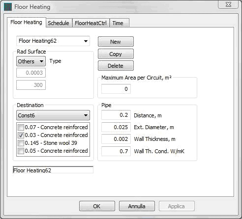
<figcaption>Figure 7 - Input data for geometry and materials.</figcaption>
</figure>

In APPENDIX A, the results obtained from the simulations are compared. In these diagrams, the results for the real geometry with a fine mesh are shown by dotted lines, while those for the simplified geometry with a coarse mesh are shown by continuous lines. The results from the 1D model are distinguished by "X" markers.

The three cases are very close to each other. In particular, heat flow prediction is highly accurate, even for the more challenging cases ("Type X1" and "Type G"). The mean temperature at pipe level may deviate more from the fine mesh results, but it still remains within acceptable accuracy ranges for these cases.

The accuracy of the 1D-to-2D simplification was checked by varying both the temperature at the external pipe surface and the temperatures of the floor and ceiling. This is a critical situation because applying a variable temperature profile at the pipe surface has a stronger effect at pipe level than varying only floor and ceiling temperatures. If only floor and ceiling temperatures are varied, the effects at pipe level are softened by the thermal inertia and resistance of the whole slab, whereas in this case the temperature variation acts much closer to the pipe level.

Regarding calculation time, the 2D model must be executed only once to calculate the thermal resistance applied in the 1D model. This can be done with a very long time step (for example, millions of seconds), so the time-dependent terms are effectively reduced to zero and steady-state behavior is obtained directly. The diagrams also show that the 2D simulations used to calculate the thermal resistance for the 1D model can be performed with simplified geometry and a coarse mesh. In other words, the preprocessing time needed to define the 1D thermal resistance is very short, typically one or two seconds.

<h2 id="bibliography"><strong>5. BIBLIOGRAPHY</strong></h2>

1. B. Glück. 1982. Strahlungsheizung - Theorie und Praxis. Verlag C.F. Müller. Karlsruhe.

2. B. Glück. 1989. Wärmeübertragung, Wärmeabgabe von Raumheizflächen und Rohren. VEB Verlag für Bauwesen.  Berlin.

3. M. Koschenz and B. Lehmann. 2000. Thermoaktive Bauteilsysteme. EMPA. Dübendorf.

4. B. Lehmann, V. Dorer and M. Koschenz. 2007. Application range of thermally activated building systems tabs. Energy and Buildings, Volume 39, Issue 5, May 2007, Pages 593-598.

5. M. Koschenz and V Dorer. Interaction of an air system with concrete core conditioning. Energy and Buildings, Volume 30, Issue 2, June 1999, Pages 139-145.

6. M. De Carli, M. Koschenz, B. W. Olesen, M. Scarpa. Dynamic evaluation of the cooling capacity of Thermo-Active Building Systems. ASHRAE 2006. Chicago.

<h2 id="appendix-a"><strong>6. APPENDIX A</strong></h2>

#### **TYPE A**

<figure id="center_img">
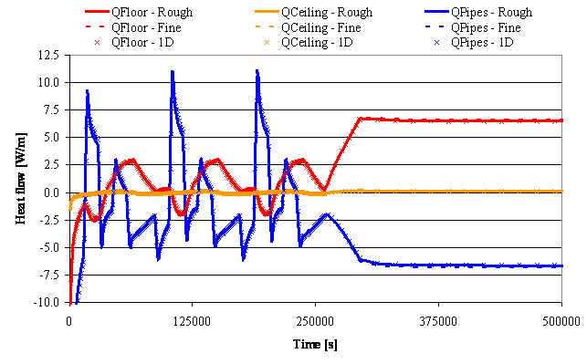
<figcaption></figcaption>
</figure>

<figure id="center_img">

<figcaption></figcaption>
</figure>

#### **TYPE E**

<figure id="center_img">

<figcaption></figcaption>
</figure>

<figure id="center_img">
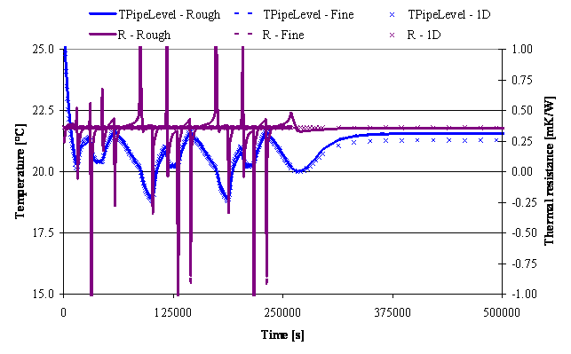
<figcaption></figcaption>
</figure>

#### **TYPE X1**

<figure id="center_img">
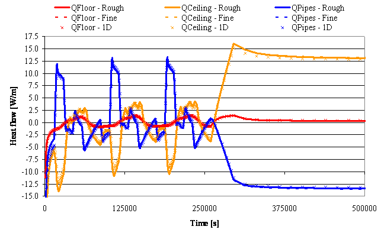
<figcaption></figcaption>
</figure>

<figure id="center_img">
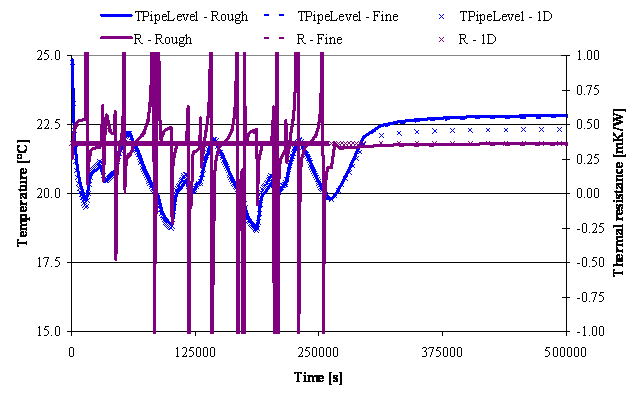
<figcaption></figcaption>
</figure>

**TYPE G**

<figure id="center_img">
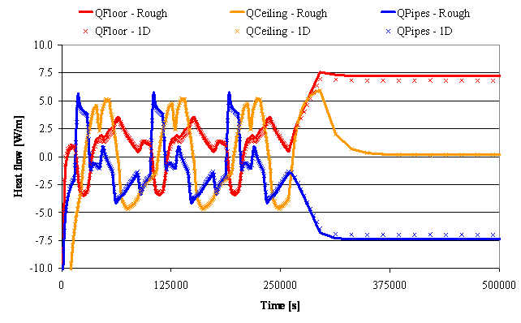
<figcaption></figcaption>
</figure>

<figure id="center_img">
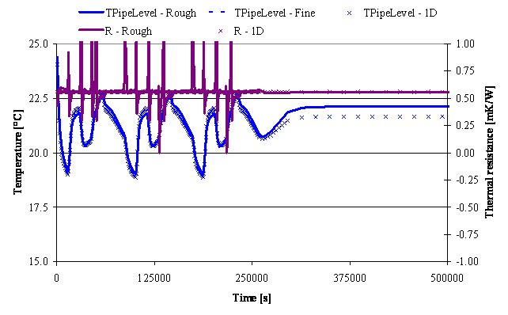
<figcaption></figcaption>
</figure>

It is important to note that the sudden variation of R in 2D simulations is caused by the sudden inversion of heat flow direction. Even with so high variations in R, the simulations performed by means of the 1D model show a great accuracy as well.
